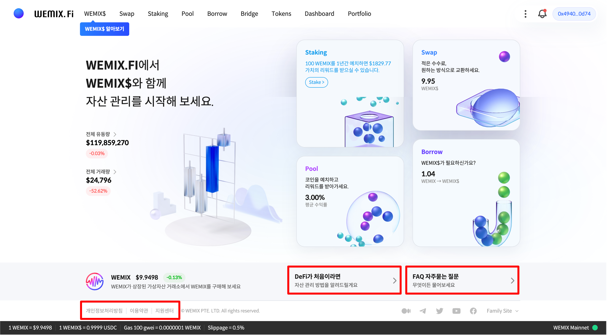

# WEMIX.Fi 준비하기

<figure><figcaption></figcaption></figure>

WEMIX.Fi는 위믹스3.0 블록체인 기반 디파이(탈중앙화 금융 거래) 플랫폼입니다. 디파이를 처음 접하는 사용자도 손쉽게 따라할 수 있도록 단계별 가이드가 준비되어 있습니다. 서비스를 이용하는 중에 문제가 발생할 경우 지원센터를 통해 도움을 받을 수 있습니다. 또한, WEMIX.Fi는 개인정보 처리방침 및 이용약관에 대하여 고지합니다. 서비스 이용 전 반드시 확인하기 바라며, 모든 내용을 이해하고 동의한 것으로 인정합니다.

## 가이드 구성

1. 지갑 생성하기

* 메타마스크 생성하기
  * 메타마스크 다운로드 및 설치
  * 비밀번호 만들기
  * 비밀문구 생성 및 확인
  * 메타마스크 생성 완료

<!---->

* WEMIX3.0 지갑 생성하기
  * WEMIX3.0 지갑 다운로드 및 설치
  * 비밀번호 및 생체 인증 방법 등록
  * 지갑 비밀문구 생성 및 확인
  * 지갑 생성 완료

2. 지갑 연결하기

* 메타마스크 연결하기
* WEMIX3.0 지갑 연결하기

3. 토큰 추가하기

* 메타마스크
  * 토큰 가져오기
  * 토큰 정보 입력
  * 토큰 추가 완료

<!---->

* WEMIX3.0 지갑

4. 기존 WEMIX Wallet 사용자라면?

