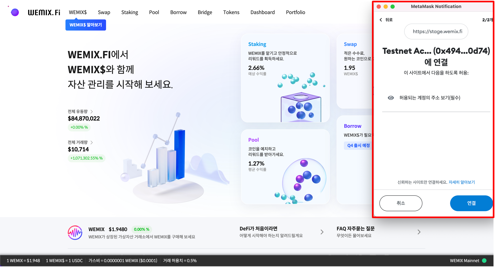
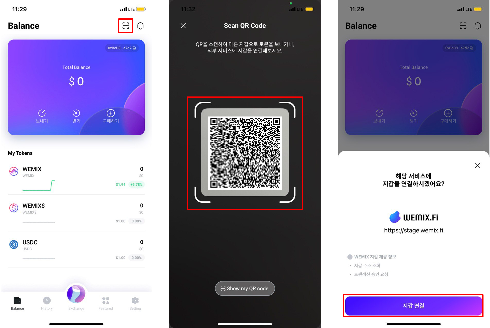

# 지갑 연결하기

## 메타마스크 연결하기

<figure><figcaption></figcaption></figure>

* WEMIX.Fi 우측 상단에 '지갑 연결' 버튼을 클릭하여 메타마스크와 연결합니다.

<figure><figcaption></figcaption></figure>

* 메타마스크 비밀번호를 입력하고 로그인합니다. WEMIX.Fi 최초 연결 시, 메타마스크가 WEMIX.Fi와 연결하도록 허용합니다.

<figure><figcaption></figcaption></figure>

* 지갑 연결 후, 우측 상단의 '지갑 연결 완료' 안내 문구를 통해 정상적으로 연결된 것을 확인할 수 있습니다.

<figure><figcaption></figcaption></figure>

* 우측 상단에 지갑 주소를 클릭하면 WEMIX.Fi와 연결된 지갑 상태를 확인할 수 있습니다.

## WEMIX3.0 지갑 연결하기

<figure><figcaption></figcaption></figure>

* WEMIX.Fi 우측 상단에 '지갑 연결' 버튼을 클릭하여 WEMIX3.0 지갑과 연결합니다.

<figure><figcaption></figcaption></figure>

* WEMIX3.0 지갑에 비밀번호를 입력하여 로그인합니다. 우측 상단에 QR 스캔 버튼을 클릭하고 WEMIX.Fi의 QR 코드를 스캔합니다. WEMIX.Fi 최초 연결 시, WEMIX3.0 지갑이 WEMIX.Fi와 연결하도록 허용합니다.
