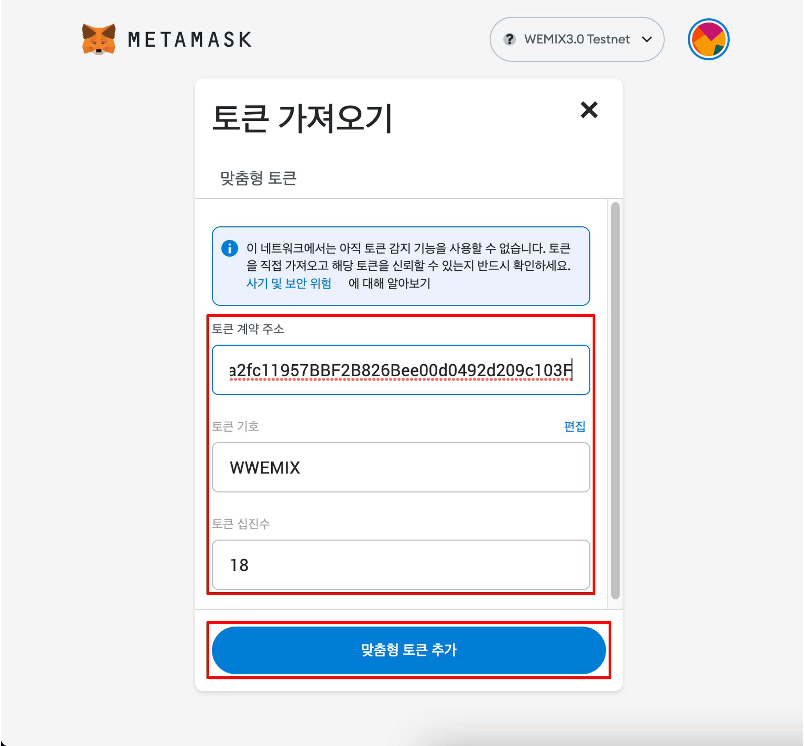

# 토큰 추가하기

## WEMIX3.0 지갑

WEMIX3.0 지갑 사용자는 토큰을 추가하지 않아도 WEMIX, WEMIX$, USDC에 대한 정보를 확인할 수 있습니다.

## 메타마스크

### 1. 메타마스크 하단의 토큰 가져오기 클릭

<figure><figcaption></figcaption></figure>

* 메타마스크 하단의 '토큰 가져오기' 버튼을 클릭합니다.

### 2. 토큰 정보 입력

<figure><figcaption></figcaption></figure>

* 토큰 가져오기 창의 추가하려는 토큰의 정보를 차례로 입력합니다. 추가하는 토큰의 토큰 주소가 정확하다면 토큰 기호와 토큰 십진수는 자동으로 채워집니다.

### 3. 토큰 추가 완료

<figure><figcaption></figcaption></figure>

* 토큰 추가가 완료되었습니다. 추가된 토큰은 '자산' 탭 목록에서 확인할 수 있습니다.

## 더 많은 토큰 정보

(TBD)
