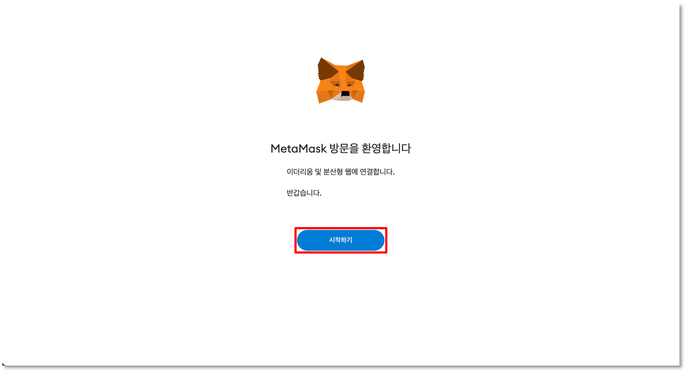
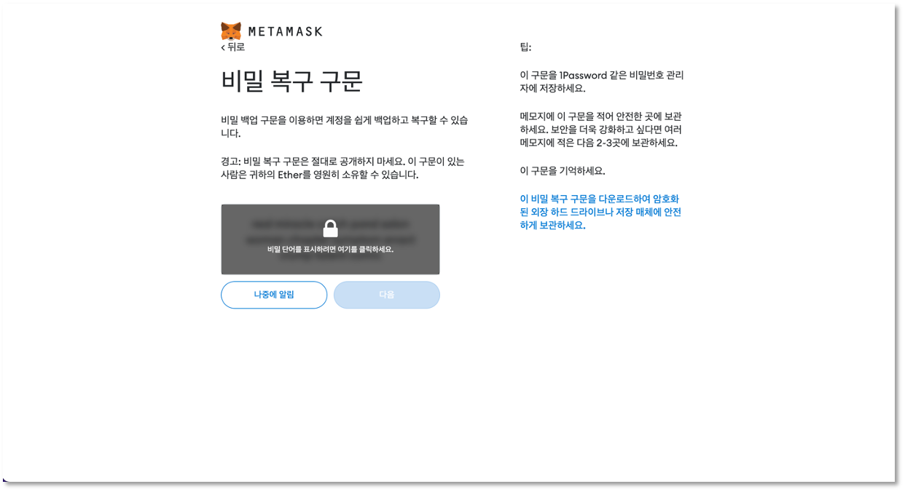

# 지갑 생성하기

<figure><figcaption></figcaption></figure>

위믹스 생태계의 다양한 서비스를 이용하시려면 메타마스크 혹은 WEMIX3.0 지갑을 생성하세요. 아래 가이드를 통해 지갑을 생성하는 방법을 확인하세요. 지갑을 만들 때 함께 생성되는 비밀번호와 비밀문구는 반드시 안전한 곳에 기록, 보관해주세요. 특히, 비밀문구를 보관하지 않은 상태에서 앱 삭제 또는 휴대폰 변경, 비밀문구가 다른 사람에게 유출되는 경우 지갑 내 자산을 잃게될 수 있습니다.

## 메타마스크 생성하기 

### 1. 메타마스크 다운로드 및 설치

<figure><figcaption></figcaption></figure>

* 메타마스크는 https://metamask.io 혹은 크롬 웹 스토어를 통해 다운로드 및 설치할 수 있습니다. 다운로드 한 메타마스크는 크롬 웹 브라우저에 확장 프로그램으로 추가할 수 있습니다.

<figure><figcaption></figcaption></figure>

<figure><figcaption></figcaption></figure>

* 메타마스크 실행 시 기존 계정을 생성하거나 복구할 수 있습니다. '지갑 생성' 버튼 선택 시 새로운 지갑 계정 생성이 가능하며, '기존 가져오기' 버튼 선택 시 기존에 생성했던 지갑 계정을 복구할 수 있습니다.

### 2. 비밀번호 만들기

<figure><figcaption></figcaption></figure>

* 메타마스크에 접속하기 위한 비밀번호를 설정합니다. 새 지갑 생성 시, 이용 약관 및 개인정보 처리방침에 동의하지 않는 경우에 지갑을 생성할 수 없습니다.

### 3. 비밀문구 생성 및 확인

<figure><figcaption></figcaption></figure>

* 비밀번호가 정상적으로 등록되면 생성된 지갑의 비밀 문구를 확인할 수 있습니다. 비밀 문구는 어떤 상황에서도 타인에게 공유되지 않도록 주의해야 합니다. 비밀 문구를 잃어버릴 경우, 지갑을 복구할 수 없습니다.

<figure><figcaption></figcaption></figure>

* 비밀 문구 확인을 위해 순서에 맞는 단어를 선택하지 못할 경우, 지갑 생성을 완료할 수 없습니다. 비밀 문구 확인이 완료되면 새 지갑이 정상적으로 생성됩니다.

### 4. 메타마스크 생성 완료

<figure><figcaption></figcaption></figure>

* 모든 단계를 마치면 정상적으로 생성한 지갑을 사용할 수 있습니다.

## WEMIX3.0 지갑 생성하기

### 1. WEMIX3.0 지갑 다운로드 및 설치

<figure><figcaption></figcaption></figure>

* WEMIX3.0 지갑은 Google Play 혹은 App Store를 통해 다운로드 할 수 있습니다.
* WEMIX3.0 지갑 실행 시 기존 계정을 생성하거나 복구할 수 있습니다. '새 지갑 생성' 버튼 선택 시 새로운 지갑 계정 생성이 가능하며, '기존 지갑 복구하기' 버튼 선택 시 기존에 생성했던 지갑 계정을 복구할 수 있습니다.
* 새 지갑 생성 시, 이용 약관 및 개인정보 처리방침에 동의하지 않는 경우에 지갑을 생성할 수 없습니다. 약관에 동의한 후, 비밀번호를 등록하며 비밀번호는 3자리 이상 같은 숫자로 등록할 수 없습니다.

### 2. 비밀번호 및 생체 인증 방법 등록

<figure><figcaption></figcaption></figure>

 

<figure><figcaption></figcaption></figure>

* 비밀번호를 등록할 때 생체 인증(Face ID, Touch ID) 등록 여부를 추가로 확인합니다. 생체 인증 방법을 등록한 경우 비밀번호 대신 단말의 생체 정보를 이용하여 앱 내 인증을 실행할 수 있습니다.

### 3. 지갑 비밀문구 생성 및 확인

<figure><figcaption></figcaption></figure>

 

<figure><figcaption></figcaption></figure>

 

<figure><figcaption></figcaption></figure>

* 비밀번호가 정상적으로 등록되면 생성된 지갑의 비밀 문구를 확인할 수 있습니다. 비밀 문구는 어떤 상황에서도 타인에게 공유되지 않도록 주의해야 하며, 비밀 문구 확인을 위해 순서에 맞는 단어를 선택하지 못할 경우, 지갑 생성을 완료할 수 없습니다. 비밀 문구 확인이 완료되면 새 지갑이 정상적으로 생성됩니다.

### 4. 지갑 생성 완료

* 모든 단계를 마치면 정상적으로 생성한 지갑을 사용할 수 있습니다.
