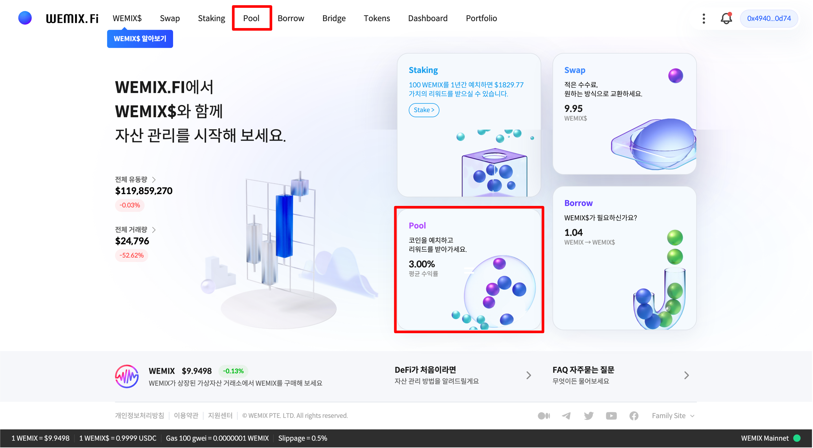
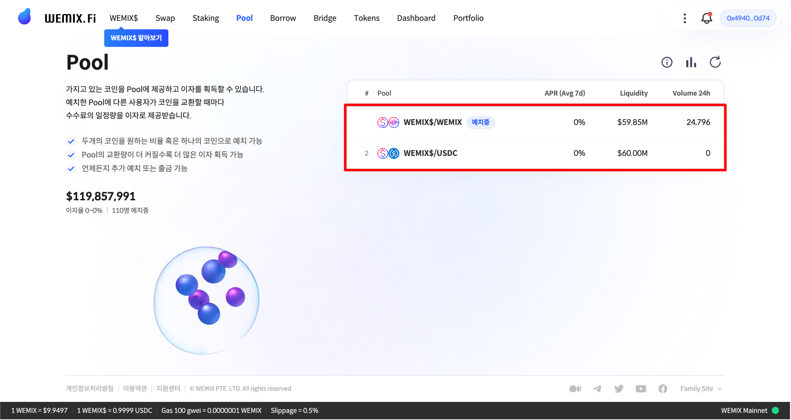
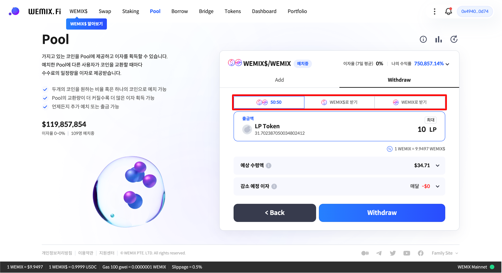
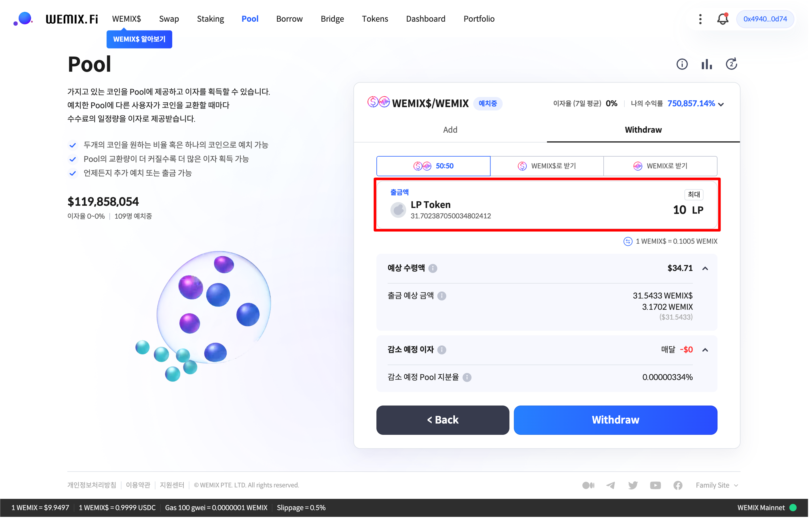
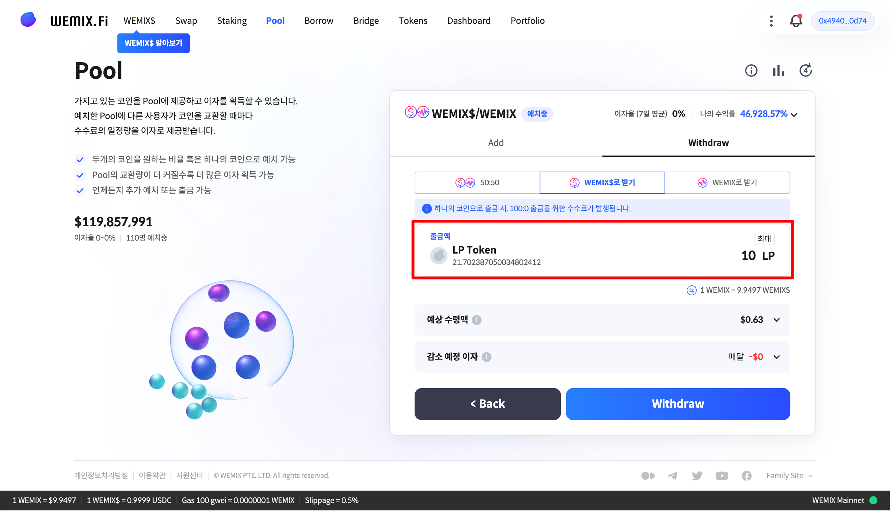
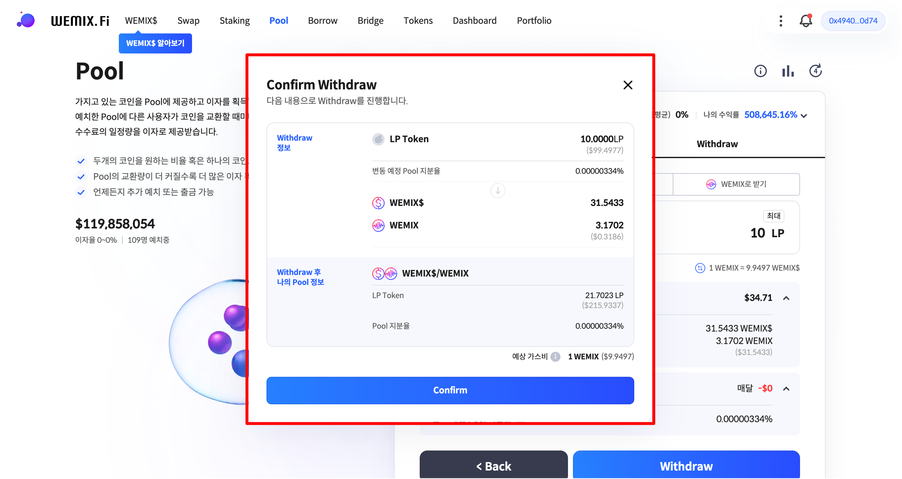
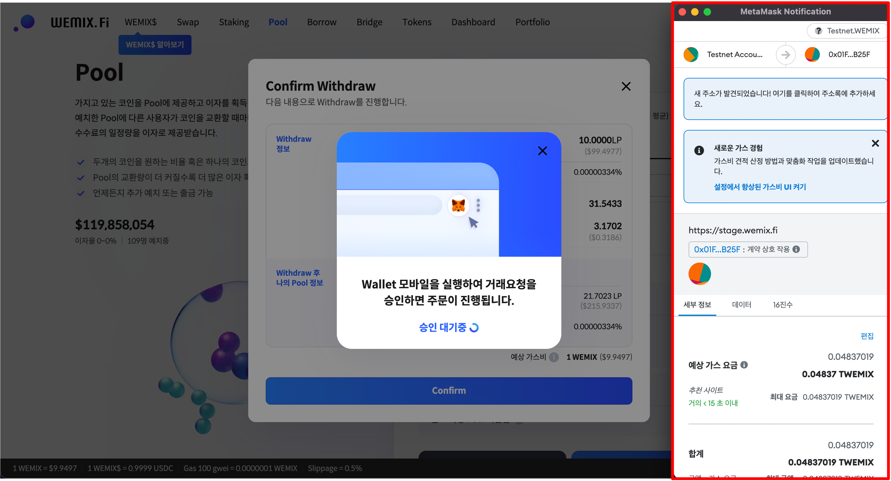
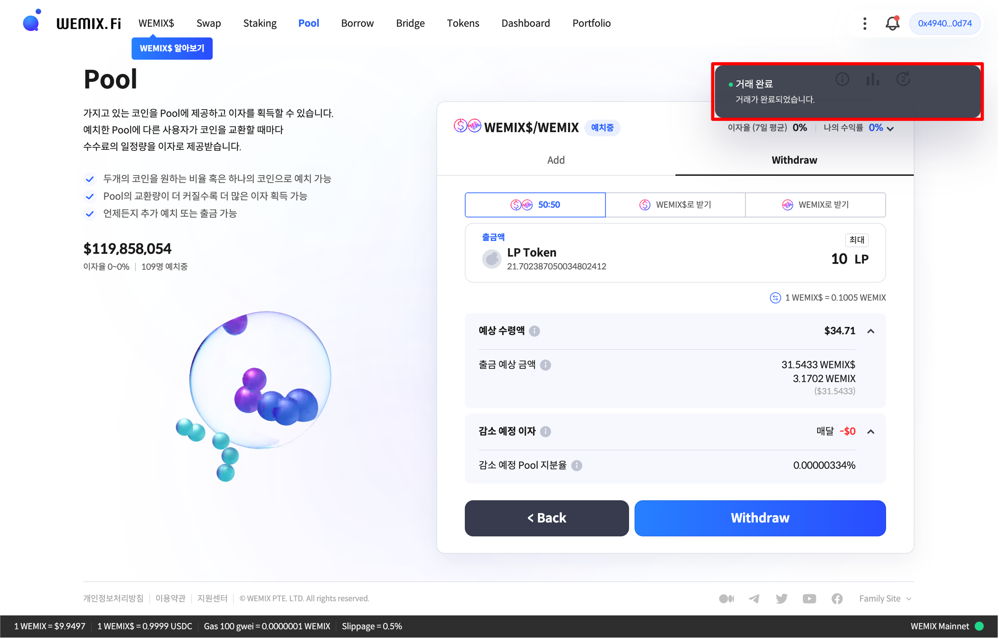

# 풀 출금하기

## WEMIX.Fi 풀 접속하기

<figure><figcaption></figcaption></figure>

* WEMIX.Fi 풀에 접속합니다. 메인 페이지에서 'Pool' 메뉴를 선택하여 풀에 접속합니다.

## 출금할 풀 선택하기

<figure><figcaption></figcaption></figure>

* 출금할 풀을 선택합니다. 사용자가 자산을 예치한 풀은 '예치중'으로 표시됩니다.

<figure><figcaption></figcaption></figure>

* 사용자는 한 쌍의 토큰을 50:50의 비율로 출금하거나, 출금할 자산을 한 종류의 토큰으로 수령할 수 있습니다. 이때, 출금할 자산을 한 종류의 토큰으로 수령할 경우, 스왑 수수료가 부과됩니다.

## 출금할 수량 선택하기

### 50:50 비율로 출금하기

<figure><figcaption></figcaption></figure>

* 출금할 수량을 입력합니다.

### 한 종류의 자산으로 출금하기

<figure><figcaption></figcaption></figure>

* 출금할 수량을 입력합니다.

## 예상 수령액 확인하기

<figure><figcaption></figcaption></figure>

* 예상 수령액을 확인합니다. 감소 예정 이자는 사용자가 출금한 수량에 따라 감소하는 수익을 의미합니다. 사용자가 출금할 수량을 입력하면 전체 유동량에 대한 지분율과 사용자가 수령할 금액을 확인할 수 있습니다.

## 출금 내역 확인 및 승인하기

<figure><figcaption></figcaption></figure>

* 출금 내역을 확인하고 승인합니다. 사용자는 출금 내역을 통해 입력한 정보를 다시 한 번 확인할 수 있습니다. 잘못 입력한 정보는 수정할 수 있으며, 이상이 없으면 'Confirm' 버튼을 눌러 출금 내역을 승인합니다.

<figure><figcaption></figcaption></figure>

* 출금을 위해 프로토콜이 사용자의 지갑에 접근할 권한을 요청하며, 트랜잭션 요청을 승인하면 출금이 실행됩니다.

<figure><figcaption></figcaption></figure>

* 출금 내역을 승인하고 트랜잭션이 정상적으로 전송된 경우, 우측 상단에 '거래 완료' 안내 문구가 나타납니다.
