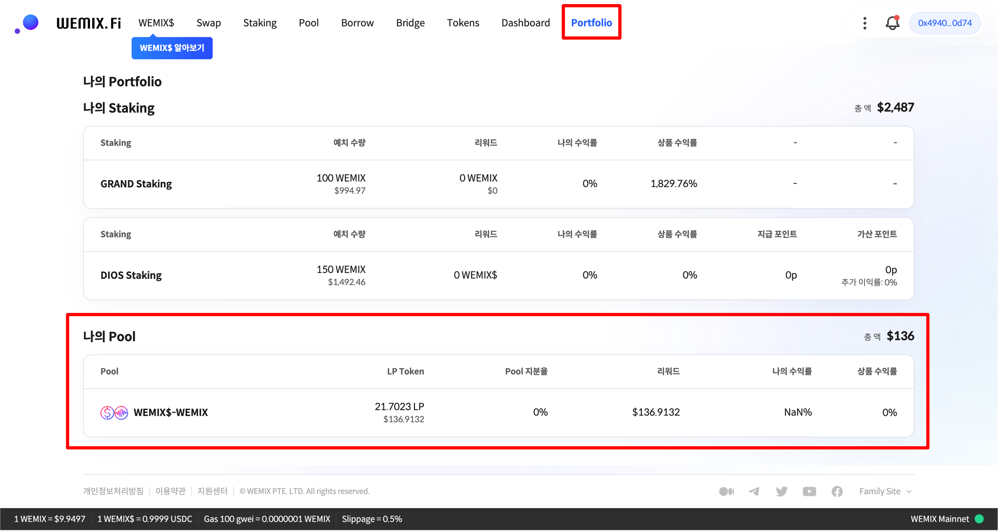
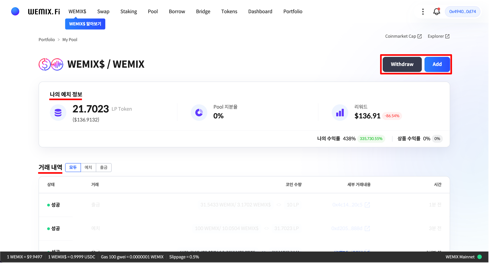

# 풀 관리하기

## 나의 풀 관리하기

<figure><figcaption></figcaption></figure>

* 상단의 'Portfolio' 메뉴를 통해 사용자의 자산을 관리할 수 있습니다. 사용자가 예치중인 풀에 대한 정보를 한 눈에 확인할 수 있습니다.

<figure><figcaption></figcaption></figure>

* 사용자가 예치중인 풀을 클릭하면 세부 예치 정보 및 과거 거래 내역을 확인할 수 있습니다.
