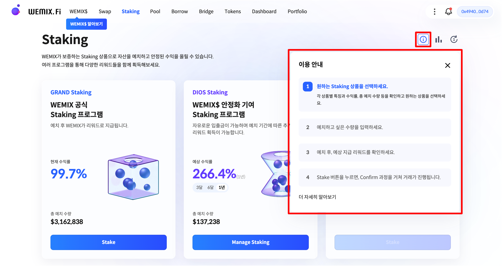

# 스테이킹 이용가이드

<figure><figcaption></figcaption></figure>

WEMIX.Fi의 스테이킹은 사용자가 보유한 자산을 예치하고 안정된 수익을 얻을 수 있는 금융 상품입니다. 상단에 ⓘ 모양의 아이콘을 클릭하면 '단계별 가이드(Step Guide)'에 따라 화면을 보면서 쉽게 따라할 수 있습니다. 본 이용가이드에는 스테이킹 상품에 따라 사용자가 보유한 자산을 예치하고 수익을 얻는 과정에 대하여 안내합니다.


WEMIX.Fi의 리퀴드 스테이킹 프로그은 2022년 4분기에 공개될 예정입니다.


## 가이드 구성

1. 지갑 연결하기

* [undefined.md](../gettingstarted/undefined.md "mention")
* [undefined-1.md](../gettingstarted/undefined-1.md "mention")

2. 그랜드 스테이킹 참여

* WEMIX.Fi 스테이킹 접속하기
* 그랜드 스테이킹 선택하기
* 예치할 수량 선택하기
* 예치 내역 확인 및 승인하기

3. 디오스 스테이킹 참여

* WEMIX.Fi 스테이킹 접속하기
* 디오스 스테이킹 선택하기
* 예치할 수량 선택하기
* 예치 내역 확인 및 승인하기

4. 스테이킹 관리하기

* 나의 스테이킹 관리하기
* 그랜드 스테이킹 관리하기
* 디오스 스테이킹 관리하기

