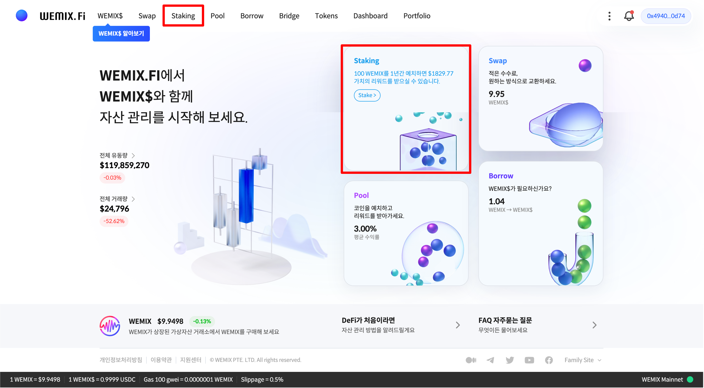
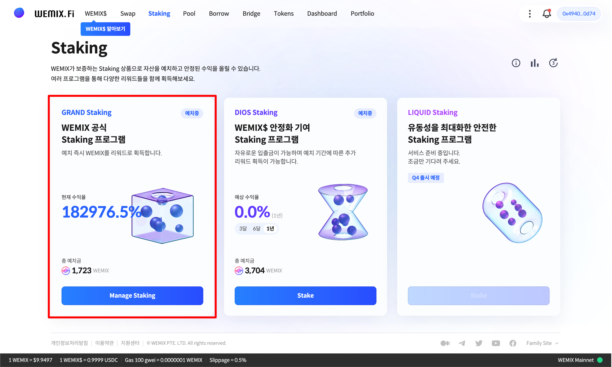
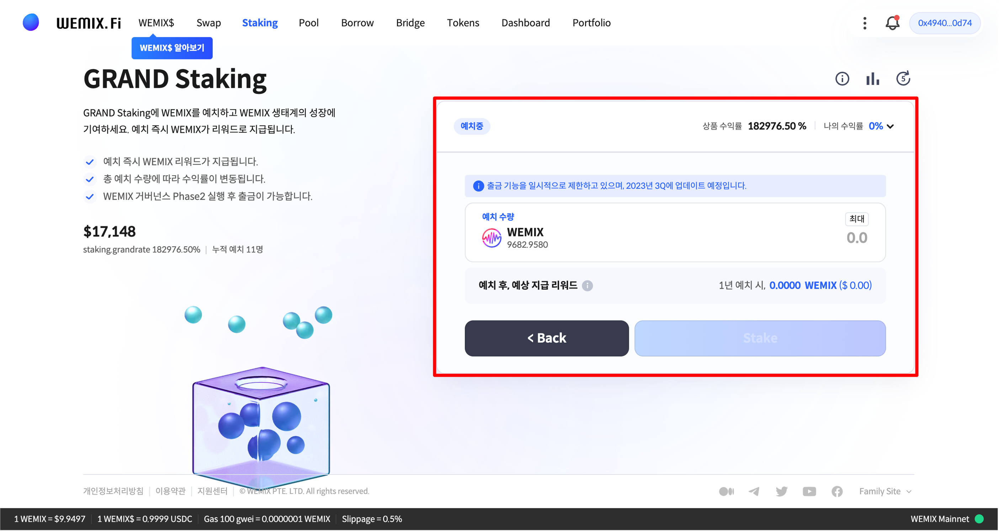
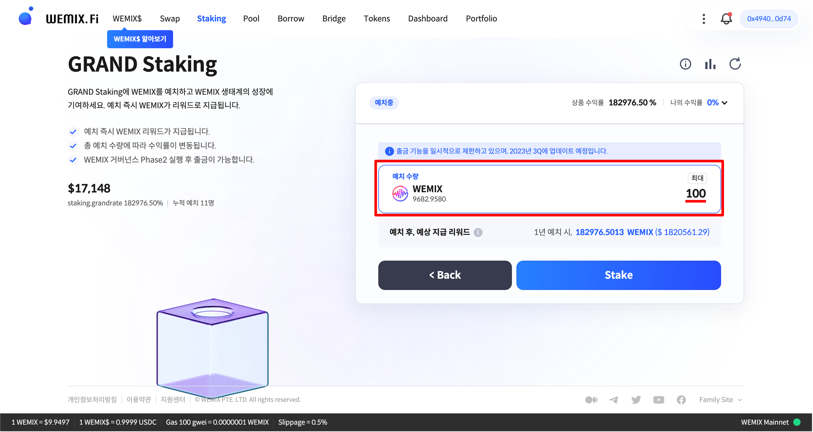
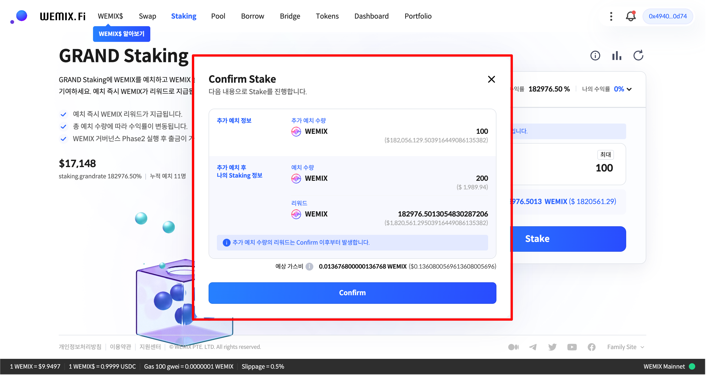
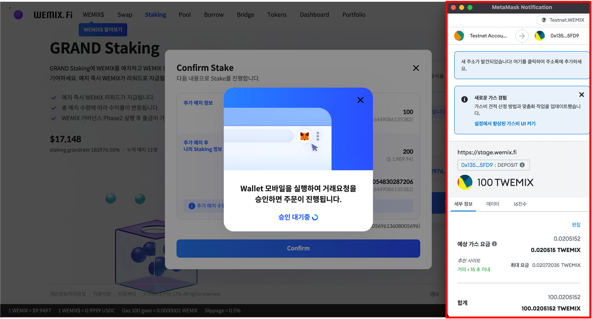
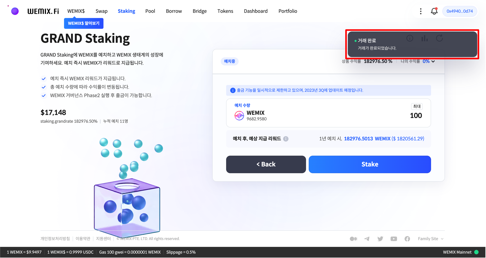

# 그랜드 스테이킹 참여

## WEMIX.Fi 스테이킹 접속하기

<figure><figcaption></figcaption></figure>

* WEMIX.Fi 스테이킹에 접속합니다. 메인 페이지에서 'Stake' 메뉴를 선택하여 스테이킹에 접속합니다.

## 그랜드 스테이킹 선택하기

<figure><figcaption></figcaption></figure>

* 스테이킹 프로그램 목록에서 그랜드 스테이킹을 선택합니다.

<figure><figcaption></figcaption></figure>

* 그랜드 스테이킹에 예치할 자산을 입력하 예상 지급 리워드를 확인할 수 있습니다.

## 예치할 수량 선택하기

<figure><figcaption></figcaption></figure>

* 스테이킹 프로그램에 예치할 수량을 입력합니다. 사용자가 예치할 수량을 입력하면 1년 예치 시 예상 지급 리워드가 계산됩니다. 예상 지급 리워드는 프로그램의 총 예치 수량과 사용자의 지분에 따라 계산됩니다.

## 예치 내역 확인 및 승인하기

<figure><figcaption></figcaption></figure>

* 예치할 내역을 확인하고 승인합니다. 사용자는 예치 내역을 통해 입력한 정보를 다시 한 번 확인할 수 있습니다. 잘못 입력된 정보는 수정할 수 있으며, 이상이 없으면 'Confirm' 버튼을 눌러 예치 내역을 승인합니다.

<figure><figcaption></figcaption></figure>

* 예치를 위해 프로토콜이 사용자의 지갑에 접근할 권한을 요청하며, 트랜잭션 요청을 승인하면 예치가 실행됩니다.

<figure><figcaption></figcaption></figure>

* 예치 내역을 승인하고 트랜잭션이 정상적으로 전송된 경우, 우측 상단에 '거래 완료' 안내 문구가 나타납니다.
