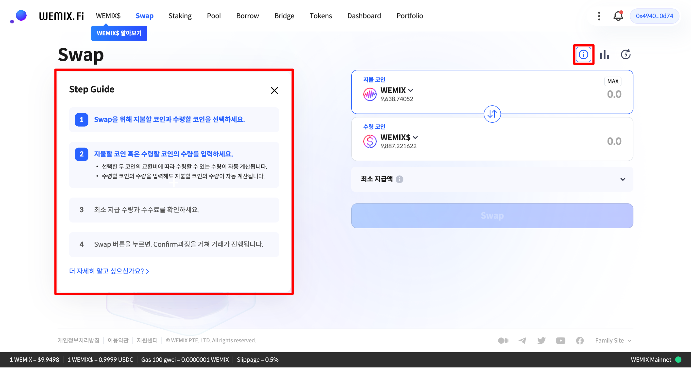

# 스왑 이용가이드

<figure><figcaption></figcaption></figure>

WEMIX.Fi의 스왑은 사용자가 보유한 가상자산을 블록체인 메인넷에서 거래할 수 있는 탈중앙화 거래 서비스입니다. 상단에 ⓘ 모양의 아이콘을 클릭하면 '단계별 가이드(Step Guide)'에 따라 화면을 보면서 쉽게 따라할 수 있습니다. 본 이용가이드에는 사용자가 보유한 자산을 거래하는 과정에 대하여 안내합니다.

## 가이드 구성

1. 지갑 연결하기

* [undefined.md](../gettingstarted/undefined.md "mention")
* [undefined-1.md](../gettingstarted/undefined-1.md "mention")

2. 스왑 사용하기

* WEMIX.Fi 스왑 접속하기
* 스왑할 자산 선택하기
* 스왑할 수량 선택하기
* 최소 지급액 및 수수료 확인하기
* 거래 허용치(Slippage Rate) 설정하기
* 스왑 내역 확인 및 승인하기
* 거래 내역 확인하기

