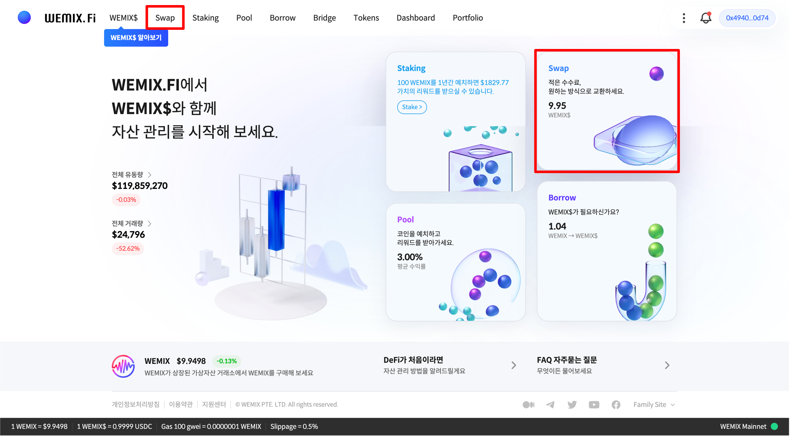
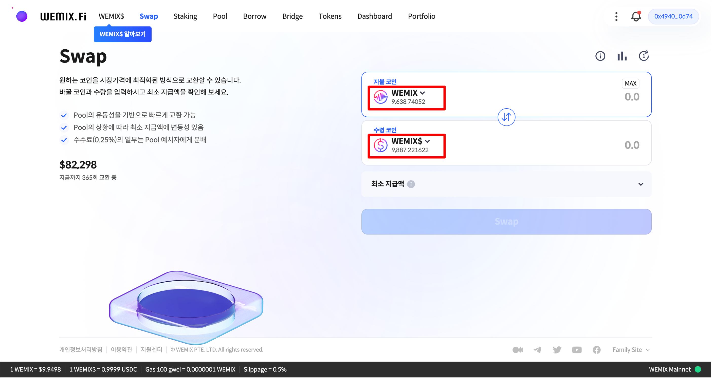
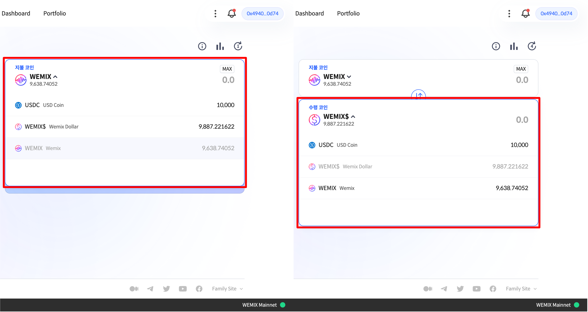
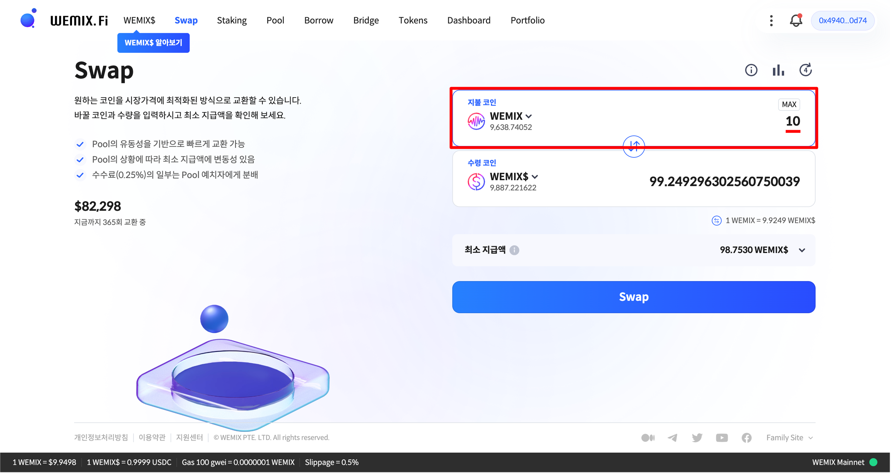
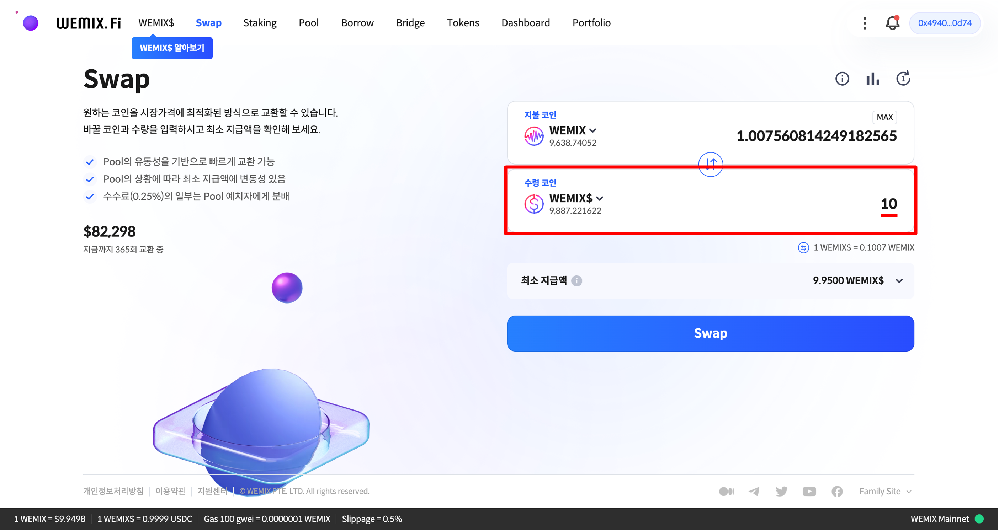
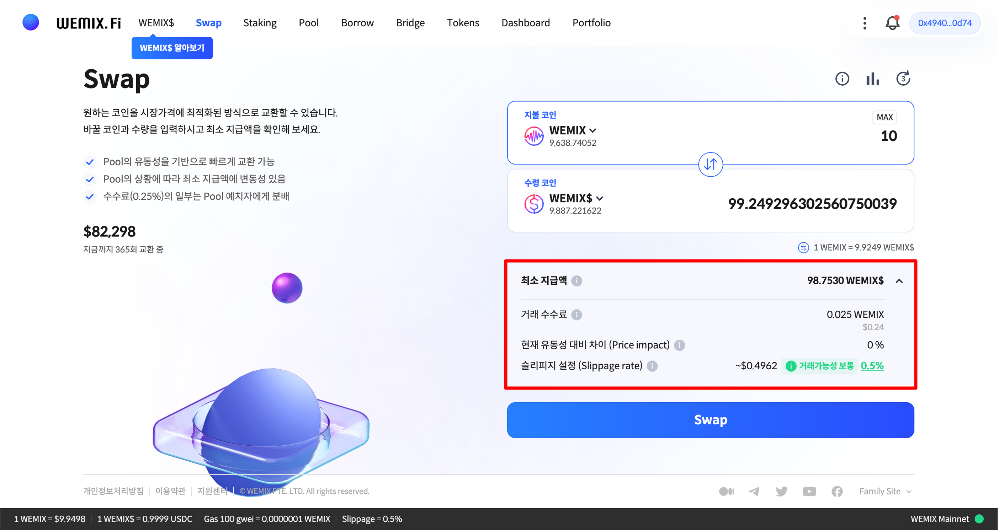
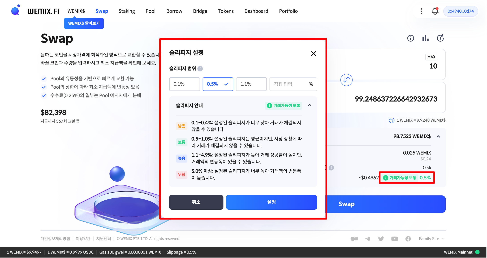
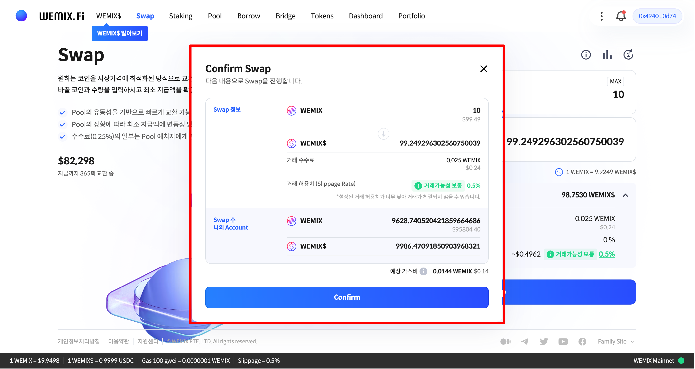
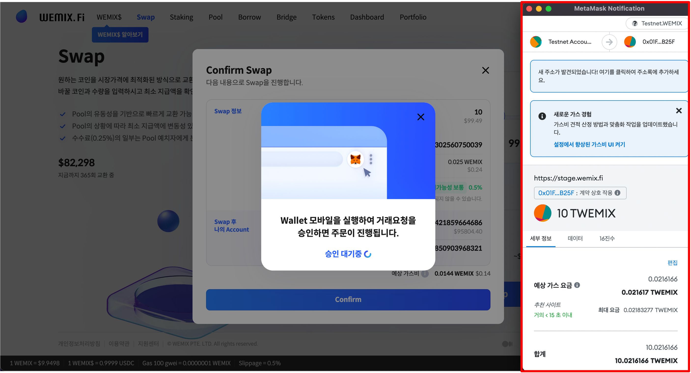
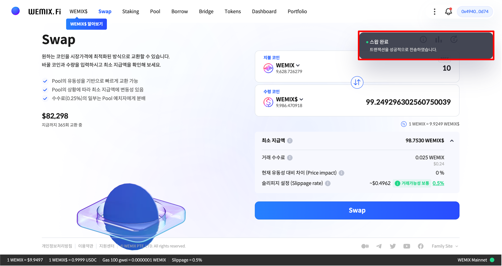

# 스왑하기

## WEMIX.Fi 스왑 접속하기

<figure><figcaption></figcaption></figure>

* WEMIX.Fi 스왑에 접속합니다. 메인 페이지에서 'Swap' 메뉴를 선택하여 스왑에 접속합니다.

## 스왑할 자산 선택하기

<figure><figcaption></figcaption></figure>

* 스왑할 자산을 선택합니다. 버튼을 누르고 목록에서 '지불 코인'과 '수령 코인'을 각각 선택합니다.

<figure><figcaption></figcaption></figure>

* 사용자가 WEMIX를 WEMIX$로 스왑하고 싶다면 '지불 코인'은 WEMIX를 선택하고, '수령 코인'은 WEMIX$를 선택합니다.

## 스왑할 수량 선택하기

<figure><figcaption></figcaption></figure>

* 스왑할 수량을 입력합니다. 사용자가 스왑할 수량을 입력하면 받게 될 수량이 자동으로 계산됩니다. 사용자가 10 WEMIX를 스왑한다면 받게될 WEMIX$의 수량은 약 99.25개로 계산됩니다.

<figure><figcaption></figcaption></figure>

* 반대로, 사용자가 받고싶은 수량을 입력하면 스왑에 필요한 수량을 자동으로 계산합니다. 사용자가 10 WEMIX$를 받고싶다면 지불해야할 WEMIX의 수량은 약 1.01개로 계산됩니다.

## 최소 지급액 및 수수료 확인하기

<figure><figcaption></figcaption></figure>

* 최소 지급액과 수수료를 확인합니다. 최소 지급액은 스왑 수수료와 최대 거래 허용치가 적용된 오차 수량을 제외하고 사용자의 지갑에 전송되는 최소 코인 수량을 의미합니다. 최소 지급액은 거래 허용치(Slippage Rate)에 따라 달라질 수 있으며, 스왑 수수료는 지불 코인의 0.25%가 부과됩니다.

## 거래 허용치(Slippage Rate) 설정하기

<figure><figcaption></figcaption></figure>

* 거래 허용치(Slippage Rate)를 설정합니다. 사용자는 유동성의 급격한 변화로 인한 피해를 방지하기 위해 슬리피지를 설정할 수 있습니다. 사용자는 슬리피지 안내에 따라 범위를 선택하거나 직접 설정할 수 있습니다.

## 스왑 내역 확인 및 승인하기

<figure><figcaption></figcaption></figure>

* 스왑 내역을 확인하고 승인합니다. 사용자는 스왑 내역을 통해 입력한 정보를 다시 한 번 확인할 수 있습니다. 잘못 입력된 정보는 수정할 수 있으며, 이상이 없으면 'Confirm' 버튼을 눌러 스왑 내역을 승인합니다.

<figure><figcaption></figcaption></figure>

* 스왑을 위해 프로토콜이 사용자의 지갑에 접근할 권한을 요청하며, 트랜잭션 요청을 승인하면 스왑이 실행됩니다.

<figure><figcaption></figcaption></figure>

* 스왑 내역을 승인하고 트랜잭션이 정상적으로 전송된 경우, 우측 상단에 '스왑 완료' 안내 문구가 나타납니다.

## 거래 내역 확인하기

<figure><figcaption></figcaption></figure>

* 'Dashboard' 메뉴를 통해 거래 내역을 확인합니다. 스왑이 완료되고 정상적으로 실행된 트랜잭션은 거래 내역에 반영됩니다. 거래 내역을 클릭하면 위믹스 익스플로러를 통해 세부내용을 확인할 수 있습니다.
