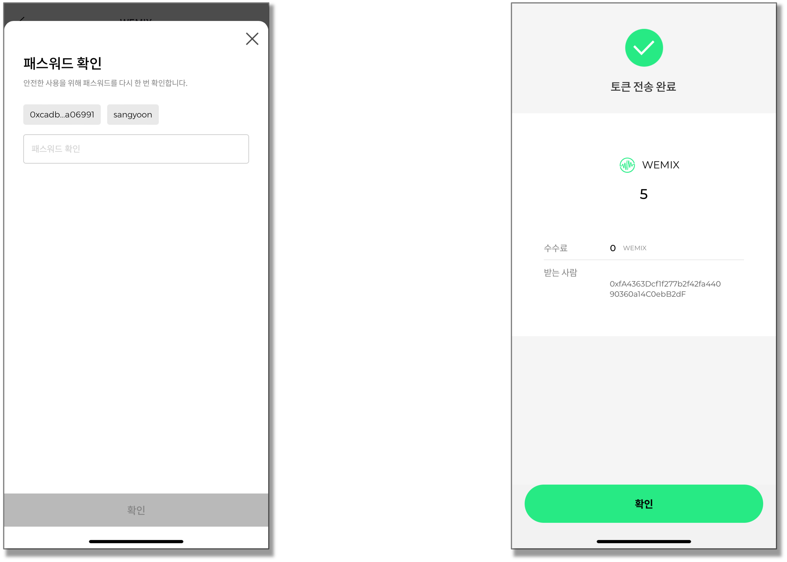

# 브릿지 이용가이드

WEMIX.Fi의 브릿지는 서로 다른 네트워크에 존재하는 자산을 전송하고 받을 수 있는 서비스입니다. 본 이용가이드에는 사용자가 서로 다른 네트워크에 보유한 자산을 위믹스 메인넷으로 옮기는 과정에 대하여 안합니다.

* Multichain을 통해 자산을 옮기는 방법
* 기존 WEMIX Wallet을 사용하고 있다면?


WEMIX.Fi의 브릿지 서비스는 2022년 4분기에 공개될 예정입니다.


## Multichain을 통해 자산을 옮기는 방법

### 1. Multichain 열기

<figure><figcaption></figcaption></figure>

WEMIX.Fi의 브릿지 서비스는 2022년 4분기에 공개될 예정입니다. 그동안 Multichain의 브릿지를 통해 자산을 옮길 수 있습니다. WEMIX.Fi의 링크에 접속하거나 multichain.org에 접속할 수 있습니다. Multichain에 접속한 뒤 우측 상단의 'Enter App'을 클릭하여 브릿지를 실행합니다.

### 2. Metamask 연결하기

<figure><figcaption></figcaption></figure>

브릿지를 실행하고 우측 상단의 'Connect Wallet'을 클릭하여 사용자의 지갑을 연결합니다. Multichain은 Metamask를 포함한 다양한 지갑과 연결이 가능하지만, WEMIXFI와 연결할 Metamask를 사용할 것을 권장합니다. Multichain에 Metamask를 연결할 때 최초 1회 승인이 필요합니다.

### 3. 자산을 보내는 네트워크와 보내는 자산 선택하기

<figure><figcaption></figcaption></figure>

Multichain에 Metamask를 연결하면 자산을 보내는 네트워크는 자동으로 '이더리움'이 설정됩니다. 사용자는 자산을 보내는 네트워크를 선택하여 변경할 수 있으며, 다른 네트워크에 연결하기 위해 최초 1회 Metamask 승인이 필요합니다. 네트워크 Metamask 확장 프로그램을 통해 전환할 수도 있습니다.

<figure><figcaption></figcaption></figure>

자산을 보내는 네트워크를 선택한 뒤, 토큰 모양의 버튼을 클릭하여 어떤 자산을 보낼지 선택합니다. 보내고자 하는 토큰이 목록에서 보이지 않을 경우, FAQ를 참고하거나 도움을 요청하여 문제를 해결할 수 있습니다.

### 4. 자산을 받을 네트워크와 수량 선택하기

<figure><figcaption></figcaption></figure>

사용자는 자산을 받을 네트워크를 선택하여 변경할 수 있습니다. 보내는 자산의 수량을 입력하면 선택한 네트워크에서 받게될 수량이 자동으로 계산됩니다. 브릿지를 통해 받게될 수량은 브릿지 수수료와 가스비가 차감된 수량으로 네트워크에 따라 다릅니다. 브릿지 수수료와 가스비에 대한 자세한 내용은 [이용 수수료](../SERVICES/undefined-2/undefined-1.md)에서 확인할 수 있습니다.

### 5. 트랜잭션 승인 및 내역 확인

<figure><figcaption></figcaption></figure>

사용자가 모든 정보를 입력한 뒤 브릿지를 통해 자산을 전송하기 위해서는 Multichain이 Metamask의 자산에 접근할 권한을 최초 1회 승인해야 합니다.

<figure><figcaption></figcaption></figure>

마지막으로 브릿지 내역을 확인하고 자산의 이동을 승인합니다. 최종 승인 후 트랜잭션 내역은 익스플로러를 통해 확인할 수 있습니다.

## 기존 WEMIX Wallet을 사용하고 계시다면?

기존 WEMIX Wallet에 보유하고 있는 WEMIX 또한 Multichain을 통해 위믹스 메인넷으로 옮길 수 있습니다. 위의 Multichain 가이드에 따라 클레이튼 메인넷에서 위믹스 메인넷으로 이동할 수 있으나, 그 전에 WEMIX Wallet에 있는 자산을 Metamask로 옮겨줘야 합니다. Metamask 계정이 없을 경우 metamask.io을 통해 생성이 가능합니다.

### 1. WEMIX Wallet에 보유한 자산 Metamask로 보내기

#### 1) WEMIX Wallet에 로그인하고 자산 목록 확인하기

<figure><figcaption></figcaption></figure>

WEMIX Wallet 앱을 실행하여 사용자 계정에 로그인하고 보유 자산 목을 확인합니다.

#### 2) WEMIX Wallet에 보유한 WEMIX 보내기

<figure><figcaption></figcaption></figure>

WEMIX Wallet의 보유 자산 목록에서 WEMIX를 선택하고 '토큰 전송' 버튼을 터치하여 '주소 입력'란에 사용자의 Metamask 주소를 입력합니다.

<figure><figcaption></figcaption></figure>

WEMIX Wallet에서 Metamask로 보낼 수량을 입력하고 전송 내역을 다시 한 번 확인합니다.

<figure><figcaption></figcaption></figure>

마지막으로, 패스워드를 입력하여 토큰 전송을 승인하면 WEMIX Wallet에 보유한 자산은 Metamask로 전송됩니다.

<figure><figcaption></figcaption></figure>

자산의 전송 내역은 클레이튼 익스플로러에서 확인하거나 Metamask를 통해 확인할 수 있습니다.
