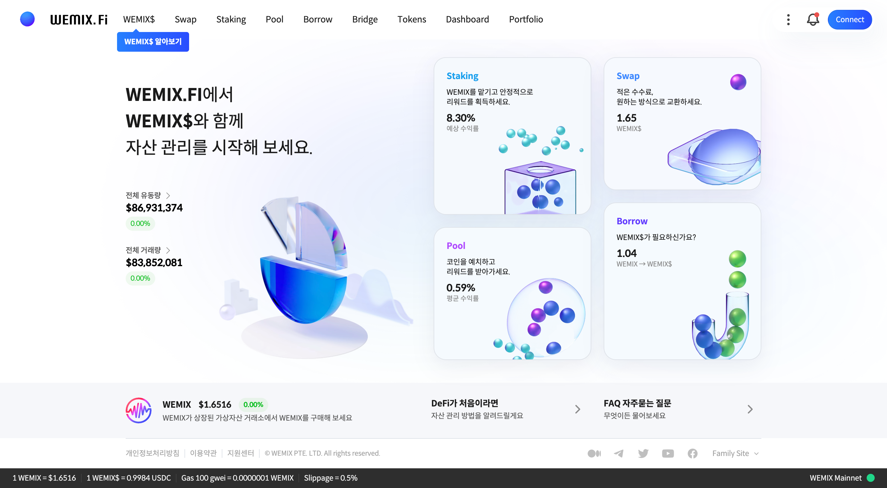

# WEMIX.Fi

<figure><figcaption></figcaption></figure>

### WEMIX.Fi는 위믹스 공식 탈중앙화 금융 플랫폼입니다.

WEMIX.Fi는 위믹스3.0 블록체인 네트워크를 기반으로 하는 안전하고 투명한 서비스를 제공하고 있습니다.

### WEMIX$와 WEMIX를 통해 안정적인 거래가 가능합니다.

WEMIX.Fi에서는 $1 가치를 지니는 WEMIX$를 사용하여 다양한 금융 서비스를 이용할 수 있습니다.

### 쉽고 빠르게 금융 서비스를 이용할 수 있습니다.

WEMIX.Fi는 스왑, 풀, 스테이킹과 같은 금융 서비스를 매우 빠른 속도와 저렴한 가스비로 제공하고 있습니다.

### 이제, 지갑을 연결하고 통합 금융 서비스를 시작해보세요.

WEMIX.Fi는 위믹스에 특화된 WEMIX3.0 지갑과 메타마스크를 지원합니다.

## WEMIX.Fi 구조도

<figure><figcaption></figcaption></figure>
