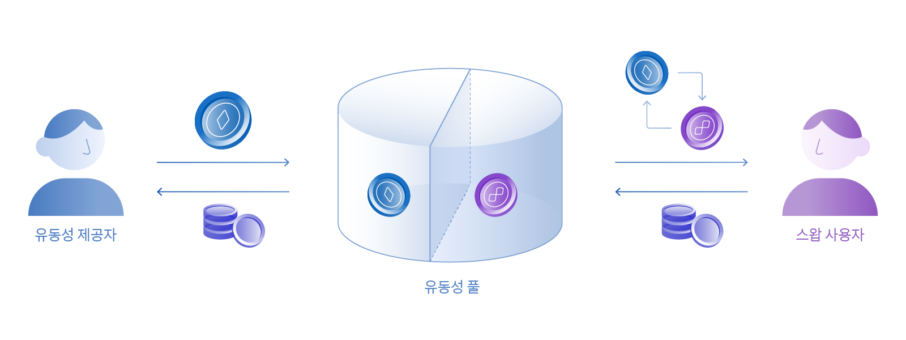

# 풀

<figure><figcaption></figcaption></figure>

보유한 토큰을 풀에 예치하고 리워드를 획득할 수 있습니다. 사용자가 예치한 풀에서 스왑이 일어날 때 발생하는 수수료의 일정량을 리워드로 제공받습니다.

* 두 개의 토큰을 원하는 비율 혹은 하나의 토큰으로 예치할 수 있습니다.
* 예치 중인 풀에서 스왑이 많이 이루어질수록 더 많은 리워드를 받을 수 있습니다.
* 언제든지 추가로 예치하거나 출금할 수 있습니다.

## 풀이란?

WEMIX.Fi의 풀은 사용자가 스왑 서비스를 지원하기 위해 유동성을 직접 공급하는 대가로 수익을 얻을 수 있는 기능입니다. 사용자가 보유한 가상자산을 유동성 풀에 예치하면 전체 유동성에 대한 지분을 얻게 되며 스왑 서비스에서 발생한 수수료의 일부를 얻게 됩니다. 사용자가 보유한 가상자산에 따라 예치할 풀을 선택할 수 있으며, 예치한 자산은 자유롭게 출금할 수 있습니다. 사용자가 자산을 예치한 풀을 통해 거래가 활발하게 이루어질수록 더 많은 수익을 얻게 됩니다.

스왑 서비스를 지원하는 유동성 풀은 각각 한 쌍의 토큰으로 구성되어 있습니다. 유동성 풀을 구성하는 토큰 쌍의 가치는 1:1로 유지되며 사용자의 자산 또한 동일한 비율로 예치됩니다. 50:50으로 예치 시 두 종류의 토큰이 동일한 가치의 수량으로 예치되며, 직접 예치를 통해 비율을 입력한 경우 두 종류의 토큰 비율이 1:1로 유지되도록 토큰을 자동 스왑하여 예치됩니다. 단, 직접 입력을 통해 스왑하여 예치할 경우 스왑 수수료가 발생하며, 거래 허용치 설정에 따라 예치가 취소될 수 있습니다.

사용자는 실시간 차트를 통해 유동성 풀에서 발생하는 거래량을 확인할 수 있으며, 사용자가 얻게 될 수익을 예측할 수 있습니다. 또한, 사용자는 자산을 추가로 예치하거나 출금할 수 있으며, 지분의 변화에 따른 수익은 실시간으로 계산됩니다.

<figure><figcaption>
유동성 공급을 통한 수익 구조
</figcaption></figure>

### 직접 입력

사용자는 자산을 동일한 비율로 예치하거나 원하는 수량을 직접 입력하여 예치할 수 있습니다. 한 쌍의 토큰을 50:50으로 예치할 경우 토큰의 수량이 자동으로 계산되며 원하는 수량을 직접 입력할 경우 50:50 비율 자동 조정을 위한 스왑 수수료가 발생합니다. 풀의 자산이 50:50으로 유지되는 이유는 [풀: 동작원리](undefined.md)에서 확인할 수 있습니다.

### 예상 리워드

사용자는 풀에 유동성을 제공한 대가로 얻을 수 있는 리워드를 확인할 수 있습니다. 예상 리워드는 풀의 성장률 및 지분율에 따라 계산되며, 스왑이 활발하게 이루어지거나 사용자가 예치한 자산이 많을수록 더 많은 리워드를 얻을 수 있습니다.

### LP 토큰

사용자는 풀에 유동성을 제공한 증표로 LP 토큰을 획득합니다. 풀에 공급된 전체 유동성에 대한 사용자의 지분을 증명하는 수단으로 활용되며, 자산을 예치하거나 출금할 때 변경되는 지분율에 따라 LP 토큰의 수량도 함께 변동됩니다.

## 풀 사용 예시

### **USDC-WEMIX$ 풀에 USDC를 예치하는 경우**

철수는 위믹스 메인넷에서 USDC 토큰을 보유하고 있습니다. USDC를 활용할 계획이 없던 철수는 자산을 예치하고 안정적인 수익을 얻을 수 있는 풀에 예치하기로 합니다. 보유한 WEMIX$가 없던 철수는 USDC-WEMIX$ 풀을 선택한 후 예치할 USDC의 수량을 직접 입력하고 전체 가치의 50%를 WEMIX$로 스왑한 뒤 풀에 예치할 수 있었습니다. 풀에 대한 철수의 지분은 LP 토큰으로 증명할 수 있으며, 6개월 이상 예치 시 예상 리워드에 만족하였으나, 비영구적 손실이 발생할 경우에 대비하여 예치한 자산을 유심히 관찰하기로 합니다.

### **WEMIX-WEMIX$ 풀에 WEMIX와 WEMIX$를 예치하는 경우**

영희는 위믹스 메인넷에서 WEMIX와 WEMIX$를  보유하고 있습니다. 영희는 WEMIX-WEMIX$ 풀을 통해 거래가 활발하게 이루어지는 것을 확인하고 풀에 유동성을 직접 공급하여 수익을 얻고자 합니다. 영희는 보유한 자산을 전체 가치의 50%씩 나누어 풀에 예치할 수 있었습니다. 영희는 실시간 차트를 유심히 관찰하고 풀을 통한 거래량 혹은 WEMIX의 가치가 대폭 하락할 경우 예치한 자산을 출금하기로 합니다.
