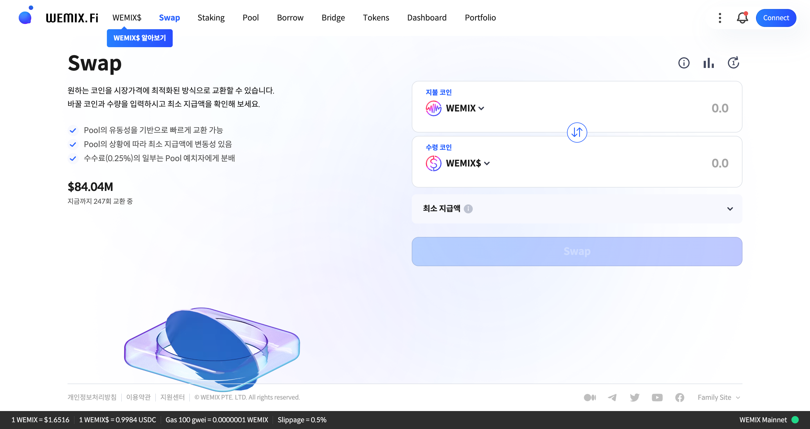
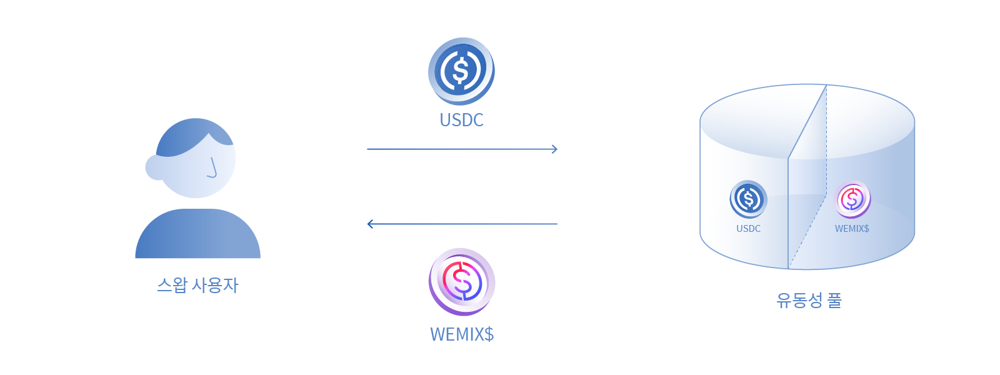

# 스왑

<figure><figcaption></figcaption></figure>

코인을 시세에 최적화된 방식으로 교환할 수 있습니다. 바꿀 코인과 수량을 입력하고 최소 지급 수량을 확인해 보세요.

* 풀의 유동성을 기반으로 빠르게 교환 가능합니다.
* 풀의 상황에 따라 최소 지급 수량에 변동 가능성이 있습니다.
* 수수료(0.25%)의 일부는 풀에 유동성을 제공한 사용자에게 분배됩니다.

## 스왑이란?

WEMIX.Fi의 스왑은 사용자가 보유한 가상자산을 블록체인 메인넷에서 직접 교할 수 있는 탈중앙화 거래 서비스입니다. 스왑 서비스를 통한 거래는 중개인을 통해 매도자와 매수자 간에 1:1 거래가 이루어지는 중앙화 거래와 달리, 블록체인 스마트 컨트랙트를 통한 사용자와 프로토콜의 상호작용으로 이루어집니다. 사용자가 보유한 가상자산으로 거래 트랜잭션을 발생시키면 자동화된 시장 형성 모델인 AMM(Automated Market Maker)에 의해 프로토콜의 '유동성 풀'과 상호작용하게 되며, 알고리즘으로 계산된 가격으로 거래가 체결됩니다. 프로토콜을 통한 거래는 이용 수수료가 발생하며, 수수료에 대한 자세한 설명은 [스왑: 이용 수수료](../../services/swap/fees.md)에서 확인할 수 있습니다.

사용자가 거래를 요청하면 AMM을 통해 유동성 풀에서 거래를 할 수 있습니다. 프로토콜의 유동성 풀은 스왑 서비스를 지원하기 위해 스마트 컨트랙트에 동결된 자금을 의미하며, 유동성 풀은 거래가 이루어지는 서로 다른 토큰 쌍으로 구성되어 있습니다. 거래가 체결되면 사용자가 거래한 자산은 유동성 풀에 유입되고 상응하는 토큰은 유동성 풀에서 차감되어 사용자에게 지급됩니다. 예를 들어, USDC와 WEMIX$의 거래는 모두 'USDC-WEMIX$ 풀'과 연결됩니다. 사용자가 USDC로 WEMIX$를 구매하는 경우, 거래된 USDC는 풀로 유입되며 상응하는 양의 WEMIX$가 풀에서 지급됩니다.

<figure><figcaption>
AMM을 통한 사용자와 유동성 풀의 거래
</figcaption></figure>

또한, 유동성 풀과 거래되는 토큰의 가격은 CPMM(Constant Product Market Maker) 알고리즘에 의해 계산되며, 토큰 쌍의 가치는 1:1로 유지됩니다. CPMM 알고리즘에 대한 자세한 내용은 [스왑: 동작원리](../../services/swap/how-it-works.md)에서 확인할 수 있습니다.


WEMIX.Fi의 스왑 서비스는 이더리움 메인넷에 존재하는 탈중앙화 거래 프로토콜 '유니스왑 V2'을 참고하여 설계되었으며, 토큰 간 교환을 포함한 핵심 기능을 유사하게 구현합니다. 스왑 서비스를 처음 접하는 사용자도 쉽게 따라 할 수 있도록 설명과 단계별 가이드가 준비되어 있습니다.


### 최소 지급 수량

거래 수수료와 최대 거래 허용치가 적용된 오차 수량을 제외하고 사용자의 지갑에 전송되는 최소 토큰 수량을 의미합니다. 거래 허용치(Slippage Rate)에 따라 제공되는 토큰 수량이 달라질 수 있습니다.

### 거래 수수료

스왑 과정에서 부과되는 수수료입니다. 스왑을 위해 사용자가 지불하는 토큰의 0.25%가 고정으로 부과됩니다.

### 거래 허용치

가격의 유동성에 따라 의도한 체결 수량과 실제 체결 수량의 차이를 허용하는 범위입니다.&#x20;

## 스왑 사용 예시

### **WEMIX를 USDC로 교환하고 싶은 경우**

철수는 위믹스 메인넷에서 WEMIX를 보유하고 있습니다. 과거에 철수는 WEMIX 토큰을 다른 토큰으로 바꾸기 위해 중앙화 거래소를 활용하여 거래를 해야 했습니다. 하지만 WEMIX.Fi의 스왑 서비스가 출시된 후 철수는 거래소를 거치지 않고 바로 WEMIX를 USDC로 교환할 수 있습니다.

### **WEMIX를 WEMIX$로 교환하고 싶은 경우**

영희는 위믹스 메인넷에서 WEMIX를 보유하고 있습니다. 영희는 WEMIX.Fi의 풀 및 스테이킹 서비스를 사용하기 위해 가치가 안정적으로 유지되는 WEMIX$을 구하고 싶습니다. 스왑 서비스를 사용하면 영희는 한 번의 트랜잭션으로 손쉽게 WEMIX를 WEMIX$로 교환 수 있습니다.
