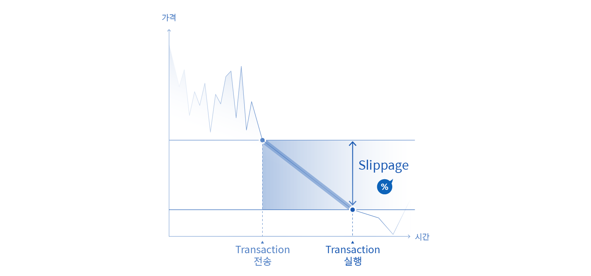

# 동작원리

## AMM : 자동화된 마켓 메이커

AMM이란 자동화된 마켓 메이커로, 사용자와 유동성 풀의 탈중앙화 거래를 자동으로 이어주는 것을 의미합니다. AMM을 구성하는 주요 요소는 가격 결정 알고리즘, 유동성 공급자, 토큰 쌍 그리고 거래자가 있습니다.

### CPMM(Constant Product Market Maker)

WEMIX.Fi의 스왑 서비스는 CPMM 알고리즘을 통해 사용자와 유동성 풀 사이에 거래되는 토큰 쌍의 가격을 결정합니다. CPMM 알고리즘은 유동성 풀을 구성하는 두 토큰의 수량을 곱한 값을 항상 일정하게 유지하며, 토큰 쌍의 거래 비율을 결정합니다. CPMM 알고리즘은 다음 수식으로 표현할 수 있습니다.

$$
X * Y = k
$$

위 수식에서 X와 Y는 각각 유동성 풀을 구성하는 토큰의 수량을 의미하며, k는 두 토큰의 수량을 곱한 상수값입니다. 예를 들어, USDC-WEMIX$ 풀에 공급된 USDC와 WEMIX$의 수량이 각각 1,000과 5,000 이라면(X = 1,000, Y = 5,000) k는 5,000,000이 됩니다.

유동성 풀의 k는 상수이며, X와 Y 중 한쪽이 증가하면 다른 한 쪽은 감소하여 곱한 값을 유지합니다. 즉, 사용자의 거래를 통해 유동성 풀의 X가 증가할 경우 전체 곱을 유지하기 위해 Y는 감소해야 하며, 결과적으로 사용자가 증가시킨 X의 양과 유동성 풀에서 감소한 Y의 양이 교환되면서 거래가 체결됩니다.

예를 들어, USDC-WEMIX$ 풀에 각각 1,000 USDC와 5,000 WEMIX$가 공급되어 있다고 가정하면 CPMM 알고리즘에 따로 풀의 초기 상태를 다음과 같이 표현할 수 있습니다. (단, 거래 수수료는 없다고 가정합니다.)

* 스왑 전 풀의 상태 : $$X=1000$$, $$Y=5000$$​, $$k=5000000$$​

사용자가 10 USDC를 스왑할 경우, $$X$$와 $$Y$$의 값이 변하더라도 곱은 $$k$$로 일정해야 하기 때문에 거래에 따라 변경된 풀의 상태는 다음과 같이 표현할 수 있습니다.

* 스왑 후 풀의 상태 : $$X'=X+10=1010$$​, $$Y'=k \space / \space X'=4950.50$$, $$k=5000000$$

위와 같이 사용자의 거래에 따라 X는 증가하고 Y는 감소하는 것을 확인할 수 있으며, 사용자의 10 USDC는 Y의 감소량인 49.5 WEMIX$로 교환되며 거래가 체결된 것을 확인할 수 있습니다.

### 유동성 제공자

스왑을 통해 거래가 이루어질 때마다 토큰 쌍의 교환 비율은 달라지며, 유동성이 적은 풀일수록 스왑 후 토큰 쌍의 교환 비율은 더 크게 달라집니다. 예를 들어, 1,000 USDC와 5,000 WEMIX$로 구성된 풀에서 100 USDC를 스왑할 경우 454.55 WEMIX$를 얻게 되며 토큰 쌍의 교환 비율은 1:4.13으로 감소합니다.

| USDC-WEMIX$ 풀 |         스왑 전 |         스왑 후 |
| ------------- | -----------: | -----------: |
| $$X$$(USDC)   |     1,000.00 |     1,100.00 |
| $$Y$$(WEMIX$) |     5,000.00 |     4,545.45 |
| $$k$$​        | 5,000,000.00 | 5,000,000.00 |
| USDC : WEMIX$ |        1 : 5 |     1 : 4.13 |

반면, 1,000,000 USDC와 5,000,000 WEMIX$로 구성된 풀에서 100 USDC를 스왑할 경우 500 WEMIX$를 얻게 되며 토큰 쌍의 교환 비율은 1:4.99으로 소폭 감소합니다.

| USDC-WEMIX$ 풀  |              스왑 전 |              스왑 후 |
| -------------- | ----------------: | ----------------: |
| $$X$$​(USDC)   |         1,000,000 |         1,000,100 |
| $$Y$$​(WEMIX$) |         5,000,000 |         4,999,500 |
| $$k$$​         | 5,000,000,000,000 | 5,000,000,000,000 |
| USDC : WEMIX$  |             1 : 5 |          1 : 4.99 |

스왑 서비스의 안정적인 운영을 위해 풍부한 유동성은 필수임을 확인할 수 있으며, WEMIX.Fi는 사용자가 직접 유동성 공급에 참여할 수 있도록 독려합니다. 사용자는 풀에 유동성을 직접 공급하고 그 대가로 수익을 얻을 수 있으며 자세한 내용은 [풀](../Pool/)에서 확인할 수 있습니다.

## Price Impact : 현재 유동성 차이

스왑 서비스를 통해 사용자와 유동성 풀 사이에 거래가 발생하면 교환 비율에 변화가 생깁니다. 교환 비율의 변동폭은 거래량이 클수록 증가할 수 있으며, 스왑 서비스의 Price Impact는 사용자의 거래로 인한 교환 비율의 움직임을 보여줍니다. 이는 사용자가 거래를 할 때 원금을 보호하기 위한 중요한 지표로 활용할 수 있습니다. 예를 들어, 1,000 USDC와 5,000 WEMIX$로 구성된 풀이 존재한다고 가정했을 때, USDC와 WEMIX$의 초기 교환비율은 1:5 입니다. 어떤 사용자가 50 USDC를 스왑하게 되면 풀을 구성하는 두 토큰의 교환 비율 약 4% 정도 감소하게 됩니다. 반면, 어떤 사용자가 USDC-WEMIX$ 풀에 유동성을 제공하면 두 토큰의 교환 비율은 다시 회복될 수 있습니다. 이처럼, 실시간으로 바뀌는 풀의 유동성에 따른 토큰 쌍의 교환 비율을 확인하여 예상치 못한 원금의 손실을 막을 수 있습니다.

## Slippage Rate : 거래 허용치

사용자가 스왑 서비스를 통해 요청한 거래 트랜잭션은 위믹스 메인넷에서 실제로 처리되기 까지 일정 시간이 소요됩니다. 유동성 풀을 구성하는 토큰 쌍의 교환 비율은 사용자가 요청한 트랜잭션이 처리되기 전에 변동될 수 있으며 사용자의 트랜잭션은 새로운 교환 비율에 처리될 수 있습니다. 사용자가 트랜잭션을 요청한 시점의 교환 비율과 실제 트랜잭션이 처리되는 시점의 교환 비율은 평균적으로 0.5\~1.0% 정도의 차이가 발생할 수 있으나, 교환 수량에 따라 5.0% 이상의 차이가 발생할 수도 있습니다.

‘거래 허용치’는 교환 비율의 차이가 일정 수준 이상으로 발생할 경우 트랜잭션의 처리를 중단시키는 장치로, 사용자가 자산의 손실을 막기 위해 설정할 수 있습니다. 거래 허용치를 낮게 설정할 경우, 자산의 손실을 최소화 할 수 있지만 교환 비율의 변동에 따라 거래가 체결될 가능성이 낮아지며, 반대로 거래 허용치를 높게 설정할 경우, 거래가 체결될 가능성은 낮아지만 교환 비율의 변동에 따라 자산의 손실이 발생할 수 있습니다.

<figure><figcaption></figcaption></figure>

* 0.1% 이하: 거래 가능성 낮음. 슬리피지가 너무 낮아 거래가 체결되지 않을 수 있습니다.
* 0.5% 이상: 거래 가능성 보통. 슬리피지는 평균이지만, 시장 상황에 따라 거래가 체결되지 않을 수 있습니다.
* 1.0% 이상: 거래 가능성 높음. 슬리피지가 높아 거래 성공률이 높지만, 거래액의 변동폭이 있을 수 있습니다.
* 5.0% 이상: 자산 변동 위험 높음. 슬리피지가 너무 높아 거래액의 변동폭이 높습니다.

## 블록케이드
