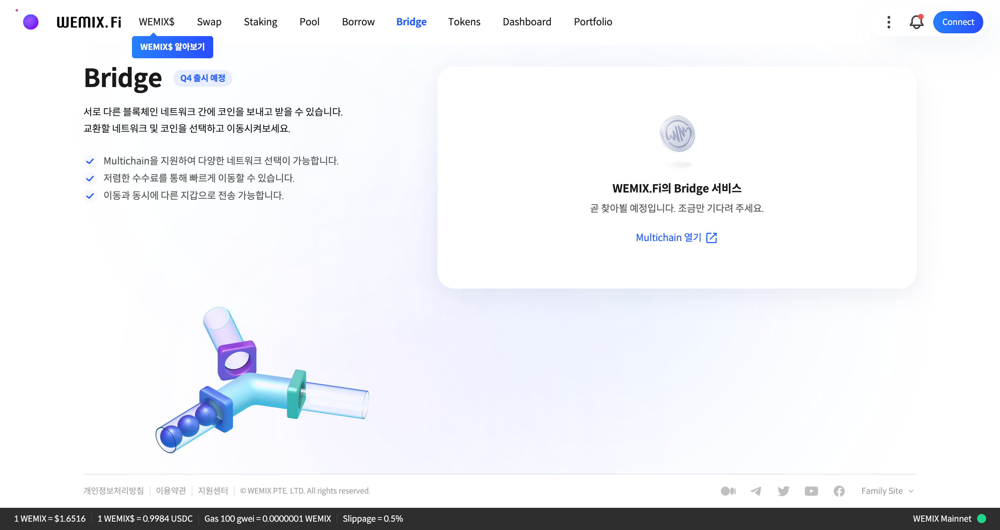

# 브릿지

<figure><figcaption></figcaption></figure>

서로 다른 블록체인 네트워크 간에 코인을 보내고 받을 수 있습니다. 교환할 네트워크 및 코인을 선택하고 이동해보세요.

* Multichain을 지원하여 다양한 네트워크 선택이 가능합니다.
* 저렴한 수수료를 통해 빠르게 이동할 수 있습니다.
* 이동과 동시에 다른 지갑으로 전송 가능합니다.

## 브릿지란?

WEMIX.Fi는 Multichain의 브릿를 통해 서로 다른 체인에 존재하는 자산을 전송하고 받을 수 있습니다. 사용자는 브릿지를 통해 다른 체인에서 보유하고 있는 자산을 소량의 수수료를 지불한 후 위믹스 메인넷으로 이동하여 위믹스 생태계가 제공하는 다양한 활동에 참여할 수 있습니다.

Multichain의 브릿지는 SMPC(Secure Multi-Party Computation) 네트워크에 의해 안전하게 동작합니다. SMPC 네트워크는 독립적인 노드로 구성되어 있으며, 노드의 각 참여자들은 분산 키 생성 알고리즘으로 생성된 프라이빗 키의 일부만 보유하여 브릿지의 탈중앙성과 보안을 보장합니다.

USDC를 보유한 사용자가 브릿지를 A체인에서 B체인으로 이동할 경우, A체인에 있는 USDC는 SMPC 네트워크의 스마트 컨트랙트에 의해 잠기게 되며, B체인에 같은 양만큼 새롭게 발행됩니다. 반대로, USDC를 다시 A체인으로 이동하고 싶은 경우 B체인에 발행되었던 USDC를 소각하고 A체인에 잠겨있는 USDC를 사용자에게 돌려줍니다. Multichain의 자세한 내용은 [브릿지: 동작 원리](broken-reference)에서 확인할 수 있습니다.

WEMIX.Fi의 브릿지는 현재 3개의 메인넷과 3개의 토큰을 지원합니다. 향후 위믹스 생태계의 확장과 함께 더 많은 메인넷과 토큰을 지원할 예정입니다.


WEMIX.Fi의 브릿지 서비스는 Multichain에서 제공하며, 독립적으로 운영됩니다. 본 문서에 제시된 브릿지에 관한 수수료, 원리, 스마트 컨트랙트 등 세부 정책은 Multichain을 따릅니다. Multichain에 대한 정보는 [Multichain Docs](https://docs.multichain.org/getting-started/introduction)에서 확인할 수 있습니다.


## WEMIX.Fi와 브릿지를 지원하는 지갑

현재 WEMIX.Fi는 Multichain의 브릿지 서비스를 사용하고 있으며, Multichain에서 지원하는 지갑은 메타마스크 입니다. 향후 WEMIX3.0 Wallet도 지원할 예정이며, 토큰별 지원하는 지갑이 다르므로, 자세한 사항은 전환할 토큰 선택 후 From 체인 영역에서 확인이 가능합니다.

## 브릿지 사용 예시&#x20;

### **이더리움, 클레이튼 메인넷에서 위믹스 메인넷으로 자산을 옮기는 경우**

철수는 이더리움 메인넷에 ETH와 USDC를 보유하고 있고, 위믹스 메인넷의 WEMIX.Fi에 참여하고 싶습니다. 이때 철수는 이더리움 메인넷과 위믹스 메인넷이 브릿지를 통해 연결 가능하지만 자산 중 USDC만 이동이 가능한 사실을 확인하였습니다. 철수는 DEX를 통해 보유중인 ETH를 USDC로 교환한 후, 브릿지를 통해 위믹스 메인넷으로 이동하여 WEMIX.Fi에 참여할 수 있었습니다.

### **팬텀, 폴리곤, BSC 등 기타 메인넷에서 위믹스 메인넷으로 자산을 옮기는 경우**

영희는 팬텀 메인넷에 ETH와 USDC를 보유하고 있고, 위믹스 메인넷의 WEMIX.Fi에 참여하고 싶습니다. 하지만, 팬텀 메인넷과 위믹스 메인넷은 브릿지를 통해 연결이 불가능한 것을 확인하였습니다. 영희는 WEMIX.Fi에 참여하기 위해 다음 두 가지 방법을 선택할 수 있습니다:\
1\. 향후 팬텀 메인넷과 위믹스 메인넷이 브릿지를 통해 연결이 가능해질 때 자산을 옮긴다.\
2\. [Multichain](https://multichain.xyz/)을 통해 팬텀 메인넷에 있는 자산을 이더리움으로 옮긴 후, 다시 위믹스 메인넷으로 옮긴다.


위믹스 메인넷과 **브릿지를 통해 연결이 가능한 메인넷 목록**과 **브릿지를 통해 이동 가능한 토큰 목록**은 [Bridge 컨트랙트](broken-reference)에서 확인할 수 있습니다.


