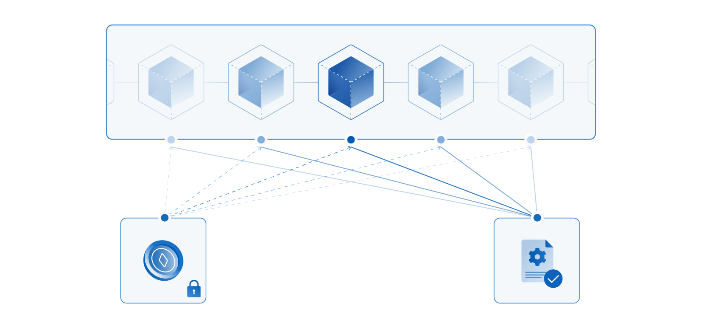

# 동작원리

## 크로스체인 브릿지

크로스체인 브릿지는 서로 다른 두 블록체인 네트워크를 연결하는 링크입니다. WEMIX.Fi는 Multichain의 브릿지 서비스를 사용하며, 한 네트워크에서 자산을 잠그고 다른 네트워크에서 동일한 가치의 토큰을 발행하는 '락 앤 민트(Lock and Mint)' 방식을 활용합니다. Multichain 브릿지를 통해 자산을 전송하는 기본적인 과정은 다음과 같습니다:



<figure><figcaption></figcaption></figure>



* 첫 번째로, 사용자의 요청에 의해 자산이 A체인에서 SMPC 네트워크의 분산관리 계정으로 잠깁니다.
* 두 번째로, SMPC 노드가 자산이 잠긴 사실을 확인하여 C체인에 서명된 스마트 컨트랙트를 보냅니다.
* 마지막으로, C체인에서 동일한 가치의 토큰을 발행합니다.

## SMPC 네트워크

SMPC(Secure Multi-Party Computation) 네트워크는 다수의 SMPC 노드로 구성되어 있으며, 브릿지를 통해 자산을 옮기기 위한 트랜잭션을 검증하고 서로 다른 체인을 연결하기 위해 다음과 같은 기능을 수행합니다:

* 서로 다른 두 네트워크 사이에 새로운 브릿지가 형성되면, SMPC 노드는 사용자가 보낸 자산을 보관할 분산 관리 계정을 생성합니다. 생성된 계정의 주소는 오직 SMPC 노드에 의해 제어됩니다.
* 또한, SMPC 노드는 자산을 이동할 네트워크의 스마트 컨트랙트에 접근할 수 있으며, 분산 관리 계정에 자산이 잠긴 것을 확인한 후, 스마트 컨트랙트를 통해 'Wrapped Token(랩드 토큰)'을 발행합니다.
* 새로운 네트워크에 발행되는 랩드 토큰은 기존 자산의 가치에 1:1로 연동되는 ERC-20 토큰으로, 교환 및 거래 등 다양한 교류가 가능합니다.
* 사용자가 자산을 다시 기존 네트워크로 이동할 경우, SMPC 노드는 스마트 컨트랙트를 통해 랩드 토큰을 소각한 후, 분산 관리 계정에 잠겨있는 자산을 사용자에게 보냅니다.

<figure><figcaption></figcaption></figure>

SMPC 네트워크의 노드들은 서로 다른 블록체인에 존재하며 각각 프라이빗 키의 일부를 소유하여 트랜잭션이 독단적으로 실행되는 것을 방지합니다. SMPC 네트워크의 보안성은 [Multichain Security Model](https://docs.multichain.org/getting-started/security/security-model)에서 확인할 수 있습니다.
