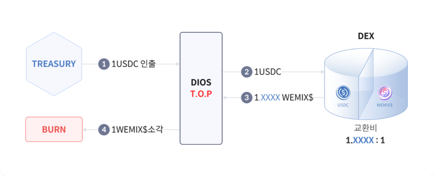

# WEMIX$ 안정화 프로토콜

WEMIX$는 온체인 준비금인 USDC와의 페깅을 통해 그 안정성을 유지합니다. 또한 스마트 컨트랙트에 따라 준비금을 보관하는 Treasury, WEMIX$의 발행과 소각이 이루어지는 MINT, 그리고 가격 유지를 위한 프로토콜인 DIOS를 통해 WEMIX$를 예치/인출하거나 발행/소각하여 WEMIX$와 USDC간의 디페깅을 방지하고, 생태계의 상황에 맞게 WEMIX$의 유통량을 조절합니다. WEMIX$의 총 유통량과 Treasury에 있는 USDC의 총 수량은 어떤한 경우에도 동일하게 유지됩니다.

## DIOS를 통한 가격 안정화

WEMIX$의 가격 유지를 위한 프로토콜인 DIOS(WEMIX Dollar IN and Out Stabilizer)는 생태계 확장에 따른 WEMIX$ 디페깅에 대한 대응인 TIP, 생태계 축소에 따른 WEMIX$ 디페깅에 대한 대응인 TOP를 통해 디페깅을 방지합니다.

### **TIP (Treasury In Protocol) : 생태계 확장에 따른 WEMIX$ 디페깅에 대한 대응**

<figure><figcaption></figcaption></figure>

생태계가 성장함에 따라 WEMIX$의 수요가 증가하게 되면 Master Liquidity Pool인 USDC/WEMIX$ 거래소에서 WEMIX$의 가격이 상승하는 디페깅이 발생합니다. 이 경우, DIOS는 TIP(Tresury -In Protocol)을 실행하게 됩니다. TIP가 실행되면 MINT 컨트렉트가 MLP에서 WEMIX$를 USDC로 교환합니다. 이때 WEMIX$의 가격이 USDC보다 더 높기 때문에 1 WEMIX$로 1 이상의 USDC를 안정화 차익으로 취득합니다. 교환된 모든 USDC는 Treasury로 입금되고 차익분만큼 추가 WEMIX$가 발행되어 DIOS의 Reward Pool로 전송됩니다.

### TOP(Treasury Out Protocol) : 생태계 축소에 따른 WEMIX$ 디페깅에 대한 대응

<figure><figcaption></figcaption></figure>

생태계가 어떤 이유로 축소되어 WEMIX$의 수요가 줄어들거나 심지어 악의적인 공격을 받으면, Master Liquidity Pool인 USDC/WEMIX$ 거래소에서 WEMIX$의 가격이 하락하는 디페깅이 발생합니다. 이 경우 DIOS는 TOP(Tresury-Out Protocol)을 실행하게 됩니다. TOP가 실행되면 Treasury에서 USDC를 출금한 후 MLP에서 USDC를 WEMIX$로 Swap합니다. 이때 WEMIX$의 가격이 USDC보다 더 낮기 때문에 1 USDC로 1 이상의 WEMIX$를 취득합니다. 1 USDC에 상응하는 1 WEMIX$는 MINT로 전송되어 소각되며 남은 WEMIX$는 안정화 차익으로 DIOS의 Reward Pool로 전송됩니다. WEMIX$의 총 공급량과 Treasury에 있는 USDC의 총 수량은 어떤한 경우에도 동일하게 유지됩니다.

### TIP & TOP 교환비

TIP & TOP의 경우 MLP의 교환비가 특정 % 이상 차이가 나게 되면 스마트컨트랙에 의해 자동으로 작동되며 풀의 교환비가 1에 근접하면 정지합니다. TIP & TOP는 거래 수수료와 슬리피지를 고려해서 손실이 나지 않는 선에서 진행됩니다. 외부 참여자의 프론트러닝을 방지하기 위해 세부 변수값은 공개되지 않습니다. 특정 변수값들은 시장 상황에 따라 변동될 수 있습니다.


DIOS Reward Pool : DIOS Reward Pool이란 DIOS로 발생한 차익을 WEMIX$로 보관한 컨트렉트입니다. Staking 상품중 하나인 DIOS Staking에 Stake한 예치자들에게 리워드로 분배됩니다.


## **블록케이드**

블록케이드는 MLP에만 적용되는 정책으로, WEMIX$의 시장 변동성을 제어하기 위한 장치입니다. MLP의 교환비가 1:1에서 5% 이상 이격이 발생할 경우 블록케이드가 발동되며 블록케이드가 발동되면 WEMIX$의 가격 안정화를 최우선으로 달성하기 위해 외부 참여자들은 MLP 접근이 제한되어 거래 및 유동성 제공/회수를 진행할 수 없습니다.&#x20;

이후 MLP 접근 권한이 있는 DIOS의 TIP & TOP가 실행되어 MLP의 교환비가 1:1 로 회귀되도록 가격 안정화를 위한 차익거래를 진행합니다. 이때 발생하는 차익은 DIOS의 Stability Pool로 전송되며, 교환비가 정상화된 후 외부 참여자들은 MLP에 다시 접근이 가능합니다.


Stability Pool : Stability Pool은 블록케이드 발동 시, DIOS의 TIP & TOP 실행으로 발생하는 차익을 보관한 컨트렉트입니다.

