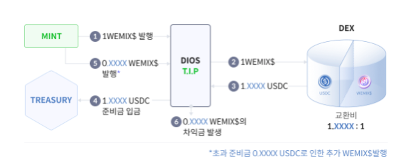

# WEMIX$ 발행

<figure><figcaption></figcaption></figure>

## WEMIX$의 안정성과 투명성

WEMIX$의 최초 발행을 위해서 WEMIX$는 Treasury에 USDC를 예치하고, 이와 동일한 양의 WEMIX$를 발행합니다. 이렇게 USDC를 예치하고 자동적으로 동일한 양의 WEMIX$를 발행하는 프로토콜을 AMA(Authorized Mint Access)라고 부르는데, 과도한 공급을 통한 경제 생태계 왜곡들을 막기 위해 AMA는 최초에는 위믹스 재단만 부여받습니다. 이후 생태계의 성장에 따라 AMA Partner들은 지속적으로 확대될 예정입니다.


MINT : MINT는 WEMIX$의 발행과 소각이 진행되는 컨트렉트입니다.



Treasury : Treasury는 WEMIX$를 발행하기 위해 사용되는 준비금인 USDC가 보관되는 주소입니다.



AMA(Authorized Mint Access) : AMA는 USDC를 예치하고 자동적으로 동일한 수량의 WEMIX$를 발행하는 프로토콜입니다.

