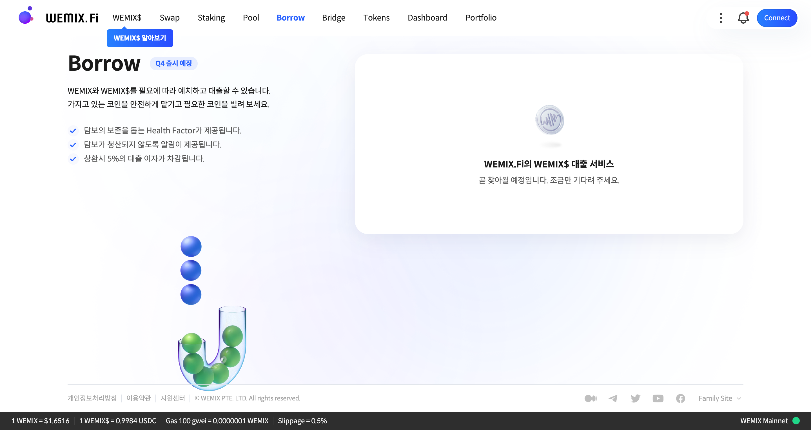

# Lend & Borrow

<figure><figcaption></figcaption></figure>

가지고 있는 코인을 예치하고 수익을 얻거나, 필요에 따라 WEMIX와 WEMIX$를 대출할 수 있습니다.

* Status Monitor로 안전하게 담보를 관리할 수 있습니다.
* 담보가 청산되지 않도록 알림이 제공됩니다.
* 예치, 대출은 복리로 계산되며, 상환 시 대출 수수료가 포함됩니다.

## Lend & Borrow란?

WEMIX.Fi의 Lend\&Borrow는 사용자가 보유한 자산을 예치하여 유동성을 제공한 대가로 수익을 얻거나, 예치한 자산을 담보로 다른 종류의 자산을 대출할 수 있는 과담보 대출 서비스입니다.

사용자가 자산을 대출할 경우, 반드시 담보 자산의 가치가 대출 자산의 가치보다 커야 하며, 상환 시 프로토콜에 따라 계산된 이자를 함께 상환해야 합니다.

또한, 사용자가 예치한 담보의 가치가 대출의 가치보다 떨어질 경우 프로토콜에 의해 담보가 경매를 통해 청산되고 대출금이 강제로 상환됩니다.


예치한 담보와 대출한 자산 모두 시장 상황에 따라 가치가 급격하게 변동될 수 있습니다. 담보로 맡긴 자산의 가치가 하락하거나, 대출한 자산의 가치가 상승하는 경우 청산이 일어날 수 있습니다. 위믹스파이에서는 Status Monitor를 통해 자산을 안전하게 보존할 수 있도록 안내하고 있지만, 높은 비율로 대출하는 경우 청산 위험에 노출될 수 있으니 이에 대해서 인지하고 있어야 합니다.


### 예치 및 대출 가능 코인

현재 WEMIX.Fi는 다음과 같이 코인을 예치하고 대출할 수 있도록 지원하고 있습니다. (론칭 시 업데이트)

| 예치 가능 코인 | 대출 가능 코인 | 담보 인정 비율 |
| -------- | -------- | -------- |
| WEMIX    | WEMIX    | 75%      |
| WEMIX$   | WEMIX$   | 95%      |
| stWEMIX  | -        | 55%      |

각 코인의 ‘담보 인정 비율’은 코인의 성격에 따라 조금씩 다르게 설정되어 있습니다. WEMIX$와 같은 스테이블 코인은 가격 변동성이 적기 때문에 보다 가격 변동성이 높은 WEMIX에 비해 담보로서 인정되는 비율이 높게 형성 됩니다. 따라서, 예치한 가치가 같더라도 대출 가능 금액은 자산별 ‘담보 인정 비율’에 따라 다르게 계산됩니다.

예를 들어, 사용자가 $100 가치의 WEMIX와 $100 가치의 WEMIX$를 예치한 경우, 사용자의 예치 총액은 $200 가치를 갖지만, 각 자산의 담보 인정 비율에 따라 $170 가치만큼 대출을 할 수 있게 됩니다.

위믹스파이에서는 높은 비율로 대출하여 청산의 위험에 노출되는 것을 방지하고자 대출 가능 금액을 별도로 설정하고 있습니다. $170에서 최대 80%까지만 대출이 가능하도록 설정되어있으며, 시장 상황의 변동으로 인해 100% 이상이 되는 경우 청산이 진행됩니다.


향후 더 많은 자산이 WEMIX.Fi의 Lend\&Borrow 서비스에 추가될 예정입니다.


### Status Monitor: 상태 모니터

안전한 담보 관리를 위한 실시간 모니터링 서비스입니다. 사용자의 담보 가치를 기준으로 ‘대출 가능 금액’ 대비 ‘현재 대출 금액’을 백분율로 나타내어 사용자의 현재 담보 상태와 대출 상태를 확인할 수 있습니다.

사용자는 자산의 가격 변동에 주의하고 상태 모니터를 주기적으로 확인하여 단계에 따라 담보를 추가로 예치하거나 대출을 상환함으로써 재정 상태를 관리할 수 있습니다.

상태 모니터는 총 다섯 단계로 구분되어 사용자의 청산 임박 시기를 경고하며, ‘위험’ 및 ‘청산’ 단계에서는 출금 및 대출이 제한됩니다.

| 상태 | 조건                        | 설명                                                     |
| -- | ------------------------- | ------------------------------------------------------ |
| 여유 | 대출 가능 금액의 30% 이하          | 안전하게 담보를 보존할 수 있다고 판단되며, 추가로 대출을 할 수 있는 상태입니다.         |
| 안전 | 대출 가능 금액의 30% 초과, 60% 이하  | 안전하게 담보를 보존할 수 있다고 판단되며, 추가로 대출을 할 수 있는 상태입니다.         |
| 주의 | 대출 가능 금액의 60% 초과, 80% 이하  | 시장 상황에 따라 담보가 위험해질 수 있으니 대출 상태를 주의 깊게 모니터링하는 것을 권장합니다. |
| 위험 | 대출 가능 금액의 80% 초과, 100% 미만 | 추가 대출 및 출금이 제한되며, 더 많은 담보를 예치하거나 대출을 상환해야하는 단계입니다.     |
| 청산 | 대출 가능 금액의 100% 이상         | 청산자에 의해 대출이 상환되며 담보가 청산됩니다.                            |

## Lend & Borrow 사용 예시

### 일시적으로 유동성을 확보하는 경우

25일은 철수의 급여 날입니다. 하지만, 22일에 월세를 내야 하는 것을 깜빡하고 모든 자산을 WEMIX에 투자했습니다. 철수는 WEMIX의 가치가 계속 오를 것이라고 생각하여, 잠시 현금화하는 것도 고민이 되었습니다. 그래서 철수는 Lending 서비스를 사용하기로 했습니다. 철수는 WEMIX를 담보로 예치하고 Wemix$를 대출했습니다. 그리고 대출한 WEMIX$를 가지고 22일에 무사히 월세를 낼 수 있었습니다. 그리고 시간이 흘러 25일 월급을 받은 철수는 대출한 WEMIX$를 상환하고 다시 WEMIX를 돌려받았습니다. 철수는 WEMIX를 시장에 팔지 않더라도 유동성을 확보하여, 현금을 급한 곳에 사용할 수 있었습니다.

### 시장 상황에 따라 공매도 전략을 실현하는 경우

영희의 냉철한 분석 결과 전체적인 경제 상황이 좋지 못하여 모든 자산들이 하락할 것이라는 결론을 내렸습니다. 그래서 영희는 위험을 피하는 것만이 아닌, 위험을 이용해서 수익을 내기 위하여 Lending 서비스를 이용하기로 했습니다. 먼저 영희는 안전한 자산인 WEMIX$를 담보로 예치하고, 1,000개의 WEMIX를 대출했습니다. 그리고 대출한 1,000개의 WEMIX를 시장에 매도했습니다. 당시의 WEMIX의 시장 가치가 $2 였기 때문에, $2,000의 현금이 영희에게 들어왔습니다. 시간이 흘러 영희의 예상대로 시장에 위기가 찾아왔고, WEMIX의 가치는 $1로 하락했습니다. 영희는 시장에서 1,000개의 WEMIX를 $1,000에 구매했고, 이를 가지고 Lending 서비스에서 상환하여 담보를 돌려받았습니다. 영희는 위험을 이용하여 $1,000의 수익을 추가로 얻게 되었습니다.

### 대출을 통해 자본금을 키워 수익을 실현하는 경우

철수는 WEMIX의 가치가 더욱 상승할 것이라고 생각하고 있습니다. 하지만 철수는 1,000WEMIX를 소유하고 있고, 좀 더 많은 양의 WEMIX를 가지고 싶어 합니다. 그래서 철수는 1,000WEMIX를 예치하고, 스테이블 코인인 WEMIX$ 500개를 빌렸습니다. 이 당시의 WEMIX의 가치가 1$이었고, 담보의 50% 정도인 $500를 빌렸기 때문입니다. 철수는 WEMIX 가치가 더욱 상승할 거라고 생각했기 때문에, 500 WEMIX$를 스왑하여 500개의 WEMIX를 확보했습니다. 시간이 흘러 WEMIX의 가치는 $1 에서 $2로 상승했습니다. 철수의 예측이 맞았습니다. 철수는 대출금으로 구매한 500개의 WEMIX를 매도하고 1,000 WEMIX$를 얻고 500 WEMIX$를 상환하고 담보로 예치한 1,000WEMIX를 돌려받습니다. 철수는 단지 1,000WEMIX를 소유만 하고 있었다면, 가치 상승 시 $1,000만큼의 이익을 얻었겠지만, Lending 서비스를 활용하여 $500의 추가 수익을 얻을 수 있었습니다.
