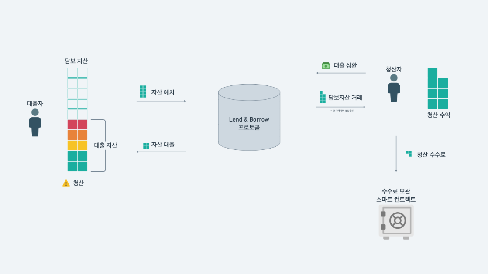

# 동작원리

## **예치와 출금**

사용자는 보유한 자산을 Lend\&Borrow 서비스에 자유롭게 예치하거나 출금할 수 있습니다. 서비스에 예치된 자산은 대출이 가능한 유동성으로 공급되며, 유동성을 공급한 사용자는 **예치 리워드**를 얻을 수 있습니다. 사용자는 금액에 제한 없이 원하는 만큼 자산을 예치하고 그에 비례하는 수익을 얻을 수 있습니다. 또한, 서비스에 예치한 자산을 담보로 활용하여 다른 종류의 자산을 대출할 수 있으며 대출 가능 수량은 자산별 담보 인정 비율에 따라 다르게 계산됩니다. 사용자는 보유한 자산을 매각하지 않고 유동성을 보존한 채로 대출 자산을 활용하여 차입 또는 레버리지와 같은 투자 기회를 얻을 수 있습니다. 단, 사용자가 대출 자산을 상환하지 못하거나 담보 자산의 가치가 하락할 경우 [**청산**](undefined.md#undefined-2)이 일어날 수 있으니 Status Monitor를 통해 재정 상태 관리를 신경 쓰도록 노력 해야합니다. 서비스에 예치한 자산은 언제든지 출금할 수 있지만, 이를 담보로 자산을 대출하여 사용자의 재정 상태([**상태 모니터**](./#status-monitor)가 위험 단계이거나, 대출금을 충분히 상환하지 못한 경우)에 따라 출금이 제한될 수 있습니다.

<figure><figcaption></figcaption></figure>

### 예치 연 수익률

예치 연 수익률은 자산을 1년간 예치했을 때 받을 것으로 예상되는 이자를 의미합니다. 이자는 매 블록마다 복리 구조로 늘어나게 되므로 변동 금리입니다.

$$
예치 \space 연 \space 수익률\space=\space(일일\space예치\space수익률^{365}-1)\space \times \space100
$$

서비스에 자산을 예치한 사용자는 대출 유동성을 공급한 대가로 대출자가 지불하는 대출 수수료의 일부를 **예치 리워드**로 획득할 수 있습니다. 예치 연 수익률이 2.5%일때 사용자가 $100 가치의 WEMIX를 예치할 경우, 사용자는 하루에 약 $0.0068을 얻을 수 있습니다. 예치 연 수익률은 예치 및 대출 자산의 수요와 공급 지표에 따라 블록마다 갱신됩니다.

## 대출과 상환

사용자는 예치한 자산을 담보로 다른 자산을 대출할 수 있습니다. 예치한 자산은 담보 인정 비율(LTV: Loan to value)에 따라 담보로써 인정받을 수 있으며, 이를 기반으로 필요한 자산을 대출할 수 있습니다. [**담보 인정 비율**](./#undefined)은 사용자가 예치한 자산이 담보물의 가치로 인정되는 비율을 의미합니다. 담보 인정 비율은 예치 자산의 가치가 담보 자산의 가치보다 항상 높게 설정되어 담보 자산의 가치가 급락하거나 대출금을 상환하지 않는 등의 금융 사고를 예방합니다.

예를 들어, WEMIX의 담보 인정 비율이 75%이고 사용자가 $100 가치의 WEMIX를 예치하여 $75 WEMIX$를 대출했다고 가정합니다. 만약, WEMIX의 가격이 하락하여 예치한 자산이 $100에서 $80가 되는 경우 프로토콜은 사용자의 대출 $75 WEMIX$ 중 50%를 대신 상환하는 조건으로 사용자의 담보물을 가져갈 수 있도록 청산을 진행합니다.

이러한 청산을 방지하기 위해서 사용자는 상태 모니터를 주의 깊게 모니터링 해야하며, 위험 단계에 임박하는 경우 더 많은 담보를 예치하거나 대출을 상환해야합니다. 상태 모니터는 사용자가 대출한 자산의 가치가 담보 자산의 가치에 얼마나 임박했는지 알려주는 지표입니다.

<figure><figcaption></figcaption></figure>

### 대출 가능 금액

사용자의 대출 가능 금액은 담보 자산의 가치에 의해 결정되며, 예치한 자산의 가치와 담보 인정 비율에 따라 계산됩니다. 단, 사용자가 대출한 금액이 담보 자산의 80%를 초과할 경우, 청산을 방지하기 위해 출금 및 추가 대출이 제한될 수 있습니다.

$$
대출\space가능\space금액\space=\space(예치\space금액)\space \times \space(담보\space인정\space비율)\space \times \space0.8\space-\space(현재\space대출)
$$

### 대출 연 수수료율

대출 연 수수료율은 자산을 1년간 대출했을 때 발생되는 대출 수수료를 의미합니다. 이자는 매 블록마다 복리 구조로 늘어나게 되므로 변동 금리입니다.

$$
대출\space연\space수수료율\space=\space(일일\space대출\space수수료율^{365}-1)\space \times \space100
$$

서비스에서 자산을 대출한 사용자는 상환 시 대출 이자를 납부해야 합니다.

예치 연 수수료율이 2.5%일때 사용자가 $100 가치의 WEMIX를 대출한 경우, 상환 시 $100 가치의 WEMIX와 수수료에 따른 이자를 납부해야 합니다. 예치 연 수수료율은 예치 및 대출 자산의 수요와 공급 지표에 따라 블록마다 갱신됩니다.

## 청산

사용자가 서비스를 통해 대출한 자산을 적기에 상환하지 못하거나 대출 자산의 가치가 담보 자산의 가치를 초과할 경우 프로토콜을 통한 청산이 진행됩니다. 청산이 진행되면 프로토콜을 통해 청산자가 대출자의 대출 자산 중 일부를 상환하고, 그 대가로 사용자의 담보물의 일부를 할인된 가격에 구매할 수 있습니다.

청산자는 청산 과정에서 대출자의 대출 자산 중 최대 50%까지 상환할 수 있으며, 상환한 양만큼 담보 자산을 10% 할인된 가격에 매수할 수 있습니다. 즉, 청산자는 대출자의 대출 자산을 상환하고 그 대가로 10%의 수익을 얻을 수 있습니다. 청산자는 대출자의 담보 자산의 일부를 매수하고 그 중 3%는 청산 수수료로 플랫폼에 지불합니다. _**청산 프로토콜 수수료는 부실 부채가 발생되지 않도록 건전한 Lend & Borrow 마켓 형성을 위해 운영 비용으로 활용합니다.**_

<figure><figcaption></figcaption></figure>

사용자의 청산 위험 단계는 Status Monitor를 통해 안내됩니다.
