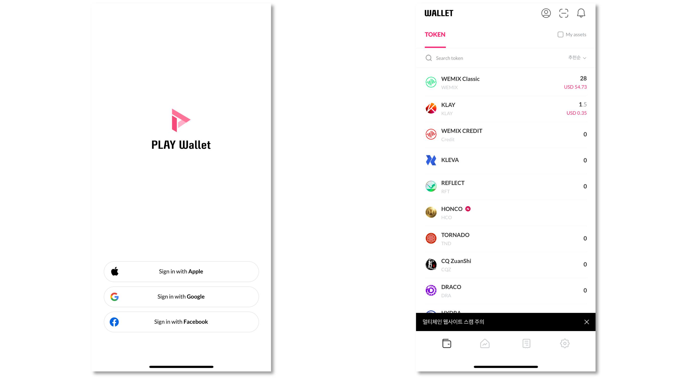
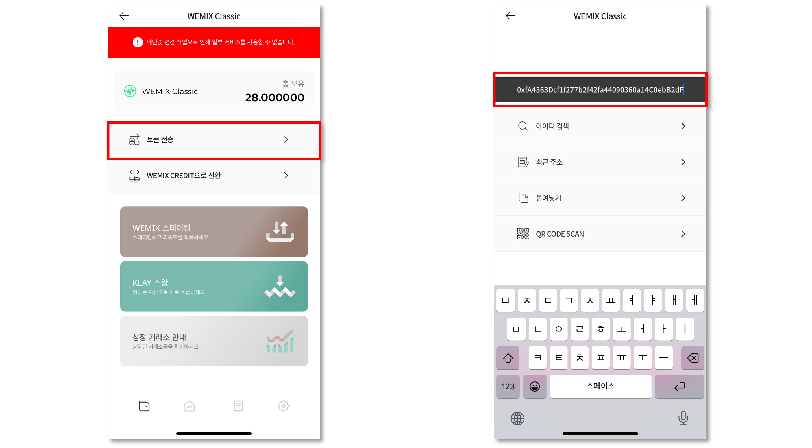
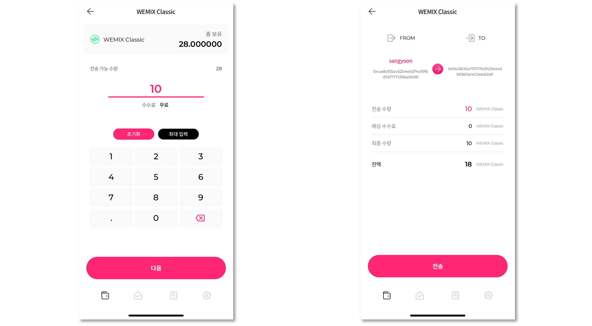
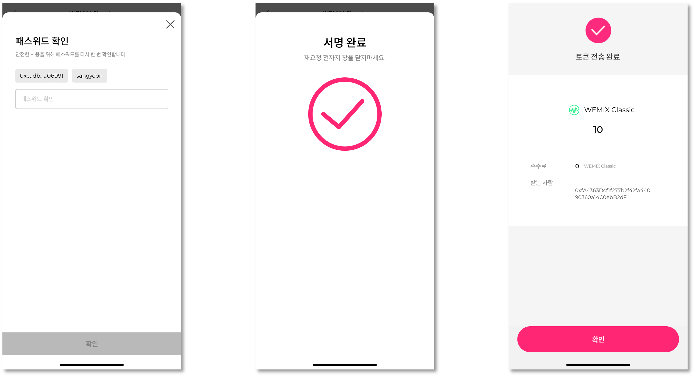
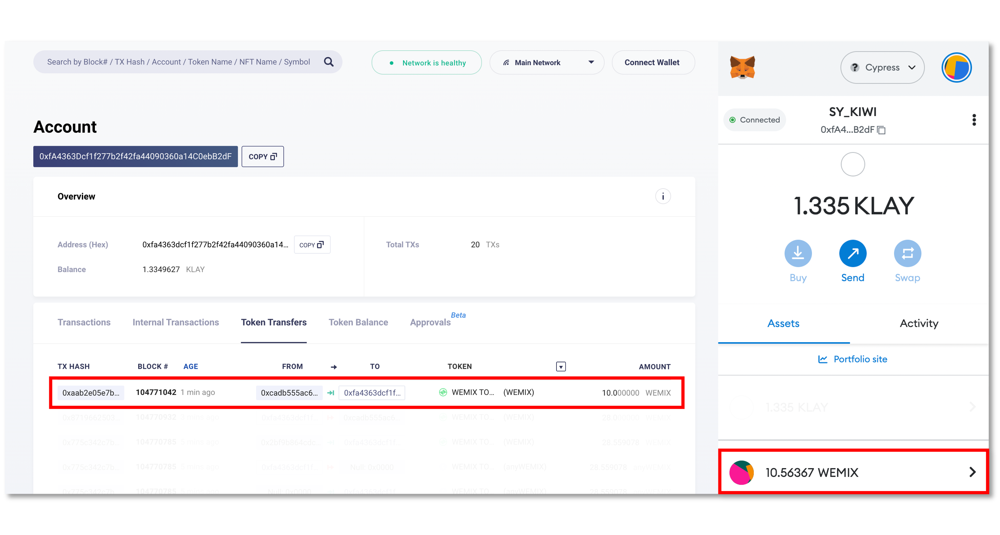

# 브릿지 이용가이드

WEMIX.Fi의 브릿지는 서로 다른 네트워크에 존재하는 자산을 전송하고 받을 수 있는 서비스입니다. 본 이용가이드에는 사용자가 서로 다른 네트워크에 보유한 자산을 위믹스 메인넷으로 옮기는 과정에 대하여 안합니다.

* Multichain을 통해 자산을 옮기는 방법
* 기존 PLAY Wallet을 사용하고 있다면?


WEMIX.Fi의 브릿지 서비스는 2022년 4분기에 공개될 예정입니다.


## 가이드 구성 

1. Multichain 이용하기

* Multichain 연결하기
* 메타마스크 연결하기
* 자산을 보내는 네트워크와 보내는 자산 선택하기
* 자산을 받을 네트워크와 수량 선택하기
* 트랜잭션 승인 및 내역 확인

2. 기존 PLAY Wallet을 사용하고 계시다면?

* PLAY Wallet에 로그인하고 자산 목록 확인하기
* PLAY Wallet에 보유한 WEMIX Classic 메타마스크로 보내기
* 전송내역 확인하기

## 기존 PLAY Wallet을 사용하고 계시다면?

기존 PLAY Wallet에 보유하고 있는 WEMIX Classic 또한 Multichain을 통해 위믹스 메인넷으로 옮길 수 있습니다. 위의 Multichain 가이드에 따라 클레이튼 메인넷에서 위믹스 메인넷으로 이동할 수 있으나, 그 전에 PLAY Wallet에 있는 자산을 메타마스크로 옮겨야 합니다. 메타마스크 계정이 없을 경우 metamask.io을 통해 생성이 가능합니다.

### 1. PLAY Wallet에 보유한 자산 메타마스크로 보내기

#### 1) PLAY Wallet에 로그인하고 자산 목록 확인하기

<figure><figcaption></figcaption></figure>

PLAY Wallet 앱을 실행하여 사용자 계정에 로그인하고 보유 자산 목을 확인합니다.

#### 2) PLAY Wallet에 보유한 WEMIX Classic 보내기

<figure><figcaption></figcaption></figure>

PLAY Wallet의 보유 자산 목록에서 WEMIX Classic를 선택하고 '토큰 전송' 버튼을 터치하여 '주소 입력'란에 사용자의 메타마스크 주소를 입력합니다.

<figure><figcaption></figcaption></figure>

PLAY Wallet에서 메타마스크로 보낼 수량을 입력하고 전송 내역을 다시 한 번 확인합니다.

<figure><figcaption></figcaption></figure>

마지막으로, 패스워드를 입력하여 토큰 전송을 승인하면 PLAY Wallet에 보유한 자산은 메타마스크로 전송됩니다.

<figure><figcaption></figcaption></figure>

자산의 전송 내역은 [클레이튼 블록탐색기](https://scope.klaytn.com/)에서 확인하거나 메타마스크를 통해 확인할 수 있습니다.
