# Multichain 이용하기

## Multichain 열기 

<figure>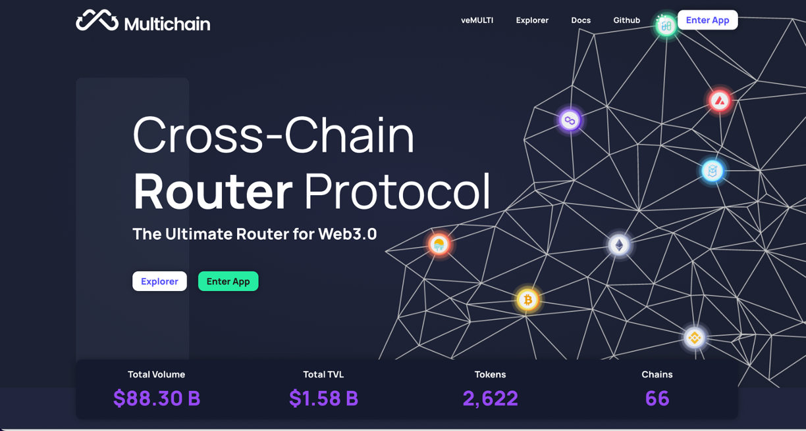<figcaption></figcaption></figure>

* WEMIX의 브릿지 서비스는 2022년 4분기에 공개될 예정입니다. 그동안 Multichain의 브릿지를 통해 자산을 옮길 수 있습니다. multichain.org에 접속할 수 있습니다. Multichain에 접속한 뒤 우측 상단의 'Enter App'을 클릭하여 브릿지를 실행합니다.

## 메타마스크 연결하기 

<figure>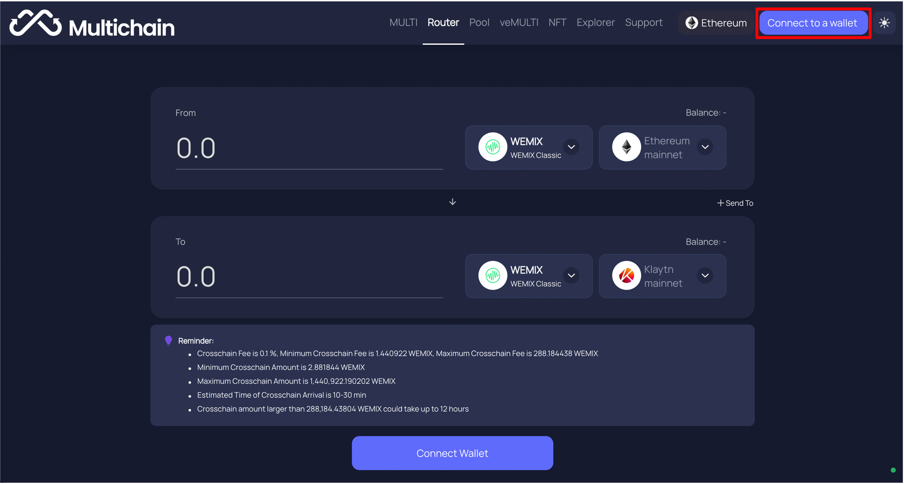<figcaption></figcaption></figure>

* 브릿지를 실행하고 우측 상단의 'Connect Wallet'을 클릭하여 사용자의 지갑을 연결합니다. Multichain은 메타마스크를 포함한 다양한 지갑과 연결이 가능하지만, 연결할 메타마스크를 사용할 것을 권장합니다. Multichain에 메타마스크를 연결할 때 최초 1회 승인이 필요합니다.

<figure>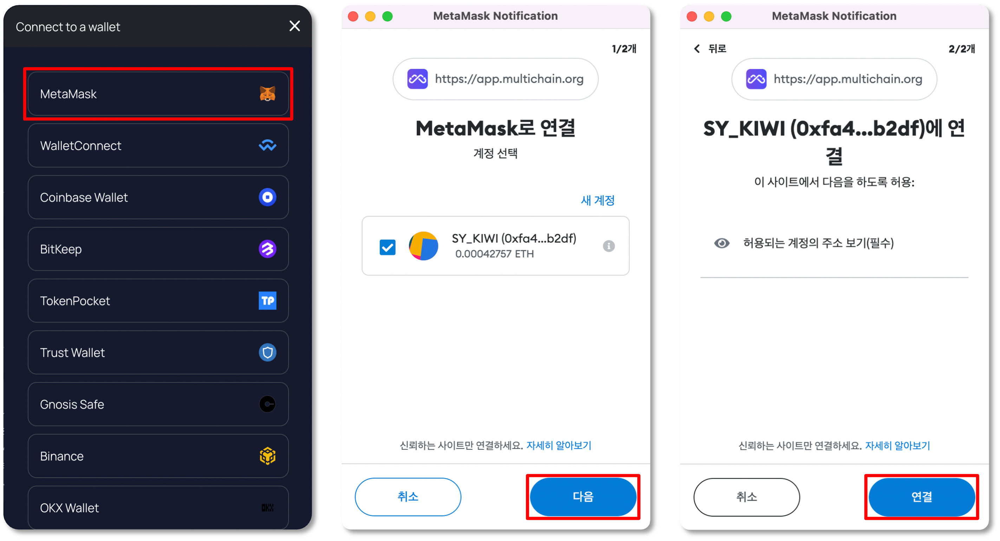<figcaption></figcaption></figure>

## 자산을 보내는 네트워크와 보내는 자산 선택하기 

<figure>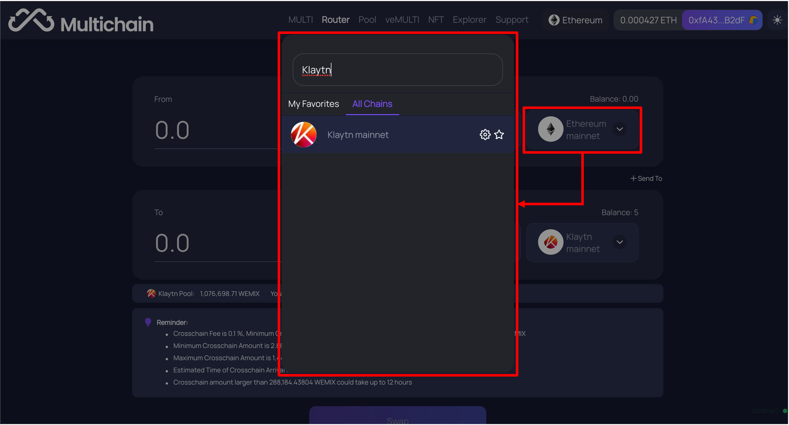<figcaption></figcaption></figure>

* Multichain에 메타마스크를 연결하면 자산을 보내는 네트워크는 자동으로 '이더리움'이 설정됩니다. 사용자는 자산을 보내는 네트워크를 선택하여 변경할 수 있으며, 다른 네트워크에 연결하기 위해 최초 1회 메타마스크 승인이 필요합니다. 네트워크는 메타마스크 확장 프로그램을 통해 전환할 수도 있습니다.

<figure><figcaption></figcaption></figure>

* 자산을 보내는 네트워크를 선택한 뒤, 토큰 모양의 버튼을 클릭하여 어떤 자산을 보낼지 선택합니다. 보내고자 하는 토큰이 목록에서 보이지 않을 경우, FAQ를 참고하거나 도움을 요청하여 문제를 해결할 수 있습니다.

<figure>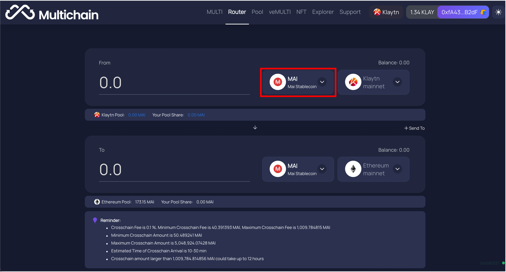<figcaption></figcaption></figure>

<figure>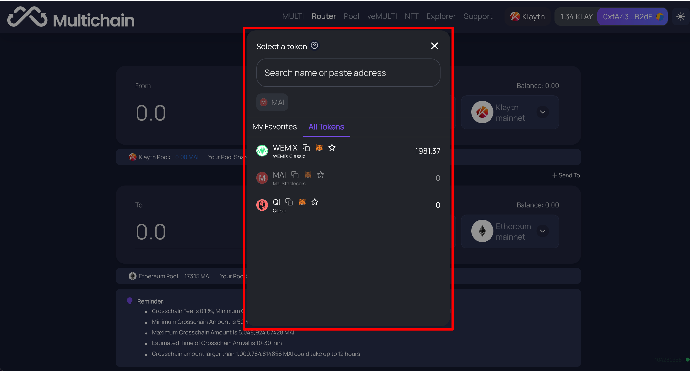<figcaption></figcaption></figure>

## 자산을 받을 네트워크와 수량 선택하기 

<figure>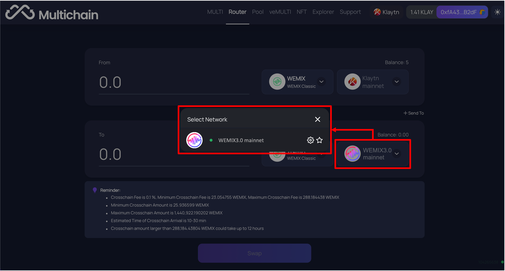<figcaption></figcaption></figure>

* 사용자는 자산을 받을 네트워크를 선택하여 변경할 수 있습니다. 보내는 자산의 수량을 입력하면 선택한 네트워크에서 받게될 수량이 자동으로 계산됩니다. 브릿지를 통해 받게될 수량은 브릿지 수수료와 가스비가 차감된 수량으로 네트워크에 따라 다릅니다.

<figure>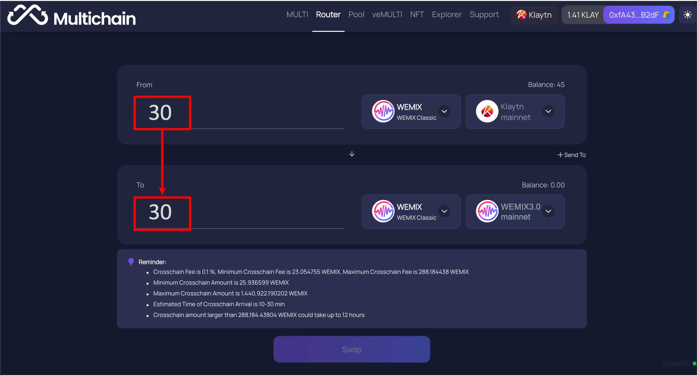<figcaption></figcaption></figure>

## 트랜잭션 승인 및 내역 확인 

<figure>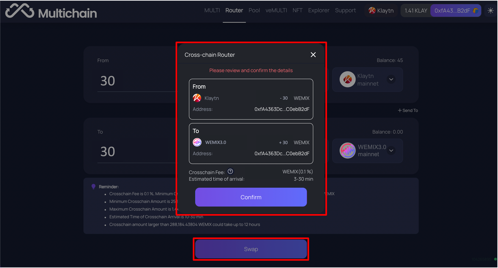<figcaption></figcaption></figure>

* 사용자가 모든 정보를 입력한 뒤 브릿지를 통해 자산을 전송하기 위해서는 Multichain이 메타마스크의 자산에 접근할 권한을 최초 1회 승인해야 합니다.

<figure>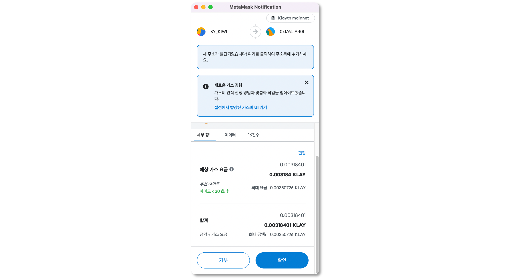<figcaption></figcaption></figure>

* 마지막으로 브릿지 내역을 확인하고 자산의 이동을 승인합니다. 최종 승인 후 트랜잭션 내역은 익스플로러를 통해 확인할 수 있습니다.

<figure><figcaption></figcaption></figure>

<figure>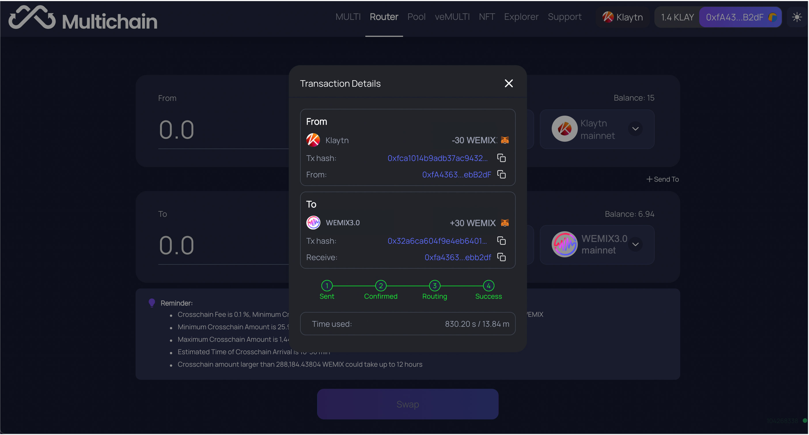<figcaption></figcaption></figure>
