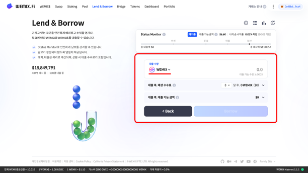

# 대출 및 상환하기

## Borrow: 자산 대출하기

### WEMIX.Fi Lend & Borrow 접속하기

<figure><figcaption></figcaption></figure>

* WEMIX.Fi Lend & Borrow에 접속합니다. 메인 페이지에서 ‘Lend & Borrow’ 메뉴를 선택하여 접속합니다.

### Borrow 선택하기

<figure><figcaption></figcaption></figure>

* 서비스에서 Borrow를 선택합니다. 사용자는 대출 가능한 자산의 종류와 대출 시 연 이자율을 확인할 수 있습니다. 사용자가 대출할 자산에 따라 연 이자율은 다를 수 있습니다.
* 사용자가 서비스에 예치한 자산이 없을 경우, Borrow 버튼은 활성화 되지 않습니다.

### 대출할 자산 및 수량 선택하기

<figure><figcaption></figcaption></figure>

* 사용자는 서비스에서 대출할 자산을 선택할 수 있습니다. 자산에 따라 연 이자율과 담보 인정 비율은 다르게 적용되며, 대출 가능한 금액은 대출 과정에서 화면을 통해 확인할 수 있습니다.

<figure><figcaption></figcaption></figure>

* 버튼을 클릭하면 대출 가능한 자산 목록과 자산별 사용자가 대출 가능한 수량을 확인할 수 있습니다.

<figure><figcaption></figcaption></figure>

* 사용자는 서비스에 예치한 자산과 담보 인정 비율에 따라 자산을 대출할 수 있습니다.

### 예상 수수료 확인하기

<figure><figcaption></figcaption></figure>

* 사용자는 한 번에 최대 수량을 대출하거나, 여러 번에 걸쳐 자산을 대출할 수 있습니다. 단, 한 번에 최대 수량을 대출할 경우 청산될 위험이 높으니 부채를 적기에 상환하도록 주의해야 합니다. 여러 번에 걸쳐 자산을 대출할 경우 현재 대출 자산을 고려하여 추가로 대출 가능한 금액을 확인할 수 있습니다.

### 대출 내역 확인 및 승인하기

<figure><figcaption></figcaption></figure>

* 대출 내역을 확인하고 승인합니다. 사용자는 대출 내역을 통해 입력한 정보를 다시 한 번 확인할 수 있습니다. 잘못 입력한 정보는 수정할 수 있으며, 이상이 없으면 ‘Confirm’ 버튼을 눌러 예치 내역을 승인합니다.

<figure><figcaption></figcaption></figure>

* 대출을 위해 프로토콜이 사용자의 지갑에 접근할 권한을 요청하며, 트랜잭션 요청을 승인하면 대출이 실행됩니다.

<figure><figcaption></figcaption></figure>

* 대출 내역을 승인하고 트랜잭션이 정상적으로 전송된 경우, 우측 상단에 ‘Borrow 대출 완료’ 안내 문구가 나타납니다.

<figure><figcaption></figcaption></figure>

* 사용자가 서비스에서 자산을 대출하면 화면 상단에 Status Monitor가 나타나며, 사용자의 재정 상태를 한눈에 확인할 수 있습니다.

## Borrow: 자산 상환하기

### Manage Borrowing 선택하기

<figure><figcaption></figcaption></figure>

* 서비스에서 Borrow를 선택합니다. 사용자가 자산을 대출하면 ‘Borrow’ 메뉴 상단에 ‘대출중’ 알림이 활성화되며, ‘Manage Borrowing’ 버튼을 통해 상환 화면으로 이동할 수 있습니다.

### 상환할 자산 및 수량 선택하기

<figure><figcaption></figcaption></figure>

* 사용자는 화면에서 ‘상환’ 메뉴를 클릭하고 상환할 수량을 입력할 수 있습니다. 사용자는 대출 자산의 규모에 따라 자유롭게 상환이 가능합니다. 단, 대출 자산의 규모가 크고, 담보 자산의 가치가 크게 변동될 경우, 청산이 되거나, 추가 대출 및 출금이 제한될 수 있습니다.

### 변동사항 확인하기

<figure><figcaption></figcaption></figure>

* 사용자가 서비스에서 자산을 상환할 경우 연 이자율과 대출 가능 금액이 새롭게 계산됩니다. 변동되는 정보는 서비스 화면을 통해 확인할 수 있습니다.

<figure><figcaption></figcaption></figure>

* 상환을 위해 프로토콜이 사용자의 지갑에 접근할 권한을 요청하며, 트랜잭션 요청을 승인하면 상환이 실행됩니다.

<figure><figcaption></figcaption></figure>

* 상환 내역을 승인하고 트랜잭션이 정상적으로 전송된 경우, 우측 상단에 ‘Borrow 상환 완료’ 안내 문구가 나타납니다. 사용자가 자산을 상환하면 Status Monitor에 반영됩니다.

<figure><figcaption></figcaption></figure>
