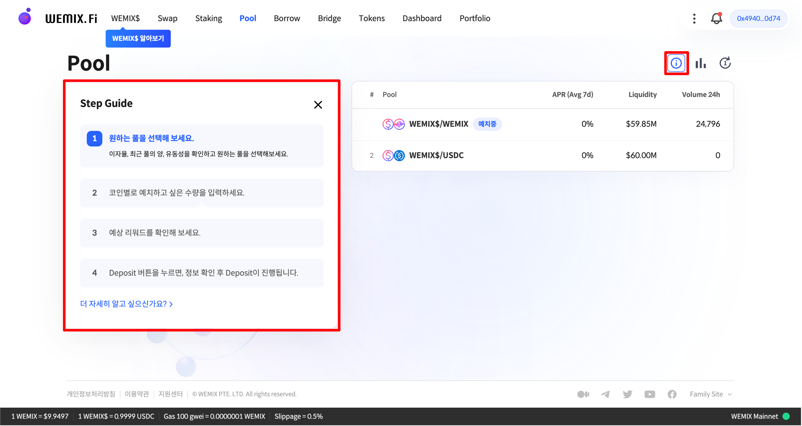

# 풀 이용가이드

<figure><figcaption></figcaption></figure>

WEMIX.Fi의 풀은 사용자가 유동성을 직접 공급하는 대가로 수익을 얻을 수 있는 기능입니다. 상단에 ⓘ 모양의 아이콘을 클릭하면 '단계별 가이드(Step Guide)'에 따라 화면을 보면서 쉽게 따라할 수 있습니다. 본 이용가이드에는 사용자가 보유한 자산을 유동성 풀에 예치하여 수익을 얻거나 출금하는 과정에 대하여 안내합니다.

## 가이드 구성

1. 지갑 연결하기

* [how-to-create-wallet.md](../getting-started/how-to-create-wallet.md "mention")
* [how-to-connect-wallet.md](../getting-started/how-to-connect-wallet.md "mention")

2. 풀 예치하기

* WEMIX.Fi 풀 접속하기
* 예치할 풀 선택하기
* 예치할 수량 선택하기
  * 50:50 비율로 예치하기
  * 예치할 수량 직접 입력하기
* 예상 리워드 확인하기
* 예치 내역 확인 및 승인하기

3. 풀 출금하기

* WEMIX.Fi 풀 접속하
* 출금할 풀 선택하기
* 출금할 수량 선택하기
  * 50:50 비율로 출금하기
  * 한 종류의 자산으로 출금하기
* 예상 수령액 확인하기
* 출금 내역 확인 및 승인하기

4. 풀 관리하기

* 나의 풀 관리하기

