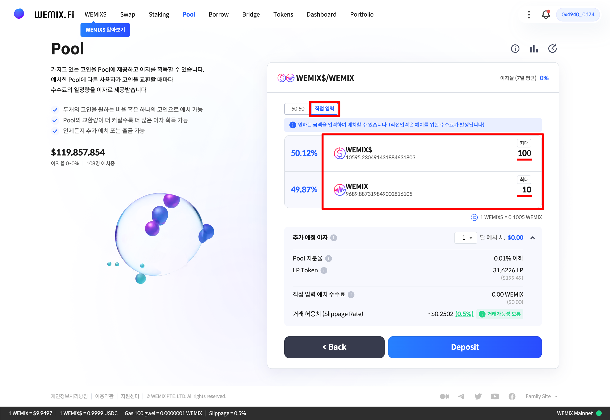

# 풀 예치하기

## WEMIX.Fi 풀 접속하기

<figure><figcaption></figcaption></figure>

* WEMIX.Fi 풀에 접속합니다. 메인 페이지에서 'Pool' 메뉴를 선택하여 풀에 접속합니다.

## 예치할 풀 선택하기

<figure><figcaption></figcaption></figure>

* 예치할 풀을 선택합니다. 풀의 유동성이나 거래량에 따라 사용자가 얻을 수 있는 수익은 다를 수 있습니다.

<figure><figcaption></figcaption></figure>

* 사용자는 한 쌍의 토큰 50:50의 비율로 예치하거나 예치할 수량을 직접 입력할 수 있습니다. 단, 입력한 수량의 가치가 서로 다를 경우 프로토콜은 스왑을 통해 토큰 쌍의 가치를 동일하게 맞추어 예치하게 됩니다.

## 예치할 수량 선택하기

### 50:50 비율로 예치하기

<figure><figcaption></figcaption></figure>

* 예치할 수량을 입력합니다. 한 쌍의 토큰을 50:50 비율로 예치할 경우, 사용자가 입력한 한 쪽 토큰의 수량에 따라 함께 예치할 나머지 토큰의 수량이 자동으로 계산됩니다. 사용자가 100 WEMIX$를(약 $200) 입력할 경우, 함께 예치할 WEMIX의 수량은 10.05으로 계산됩니다.

<figure><figcaption></figcaption></figure>

* 반대로, 사용자가 100 WEMIX(약 $995)를 입력할 경우, 함께 예치할 WEMIX$의 수량은 994.98로 계산됩니다.

### 예치할 수량 직접 입력하기

<figure><figcaption></figcaption></figure>

* 사용자는 각 토큰의 보유량에 따라 예치할 수량을 직접 입력할 수 있습니다. 단, 사용자가 예치할 토큰의 가치가 서로 다를 경우, 프로토콜은 더 많은 토큰의 일부를 스왑하여 토큰 쌍의 가치가 50:50이 되도록 조정 합니다. 이 과정에서 발생하는 스왑 수수료는 사용자가 지불하며, 스왑이 필요한 이유는 [풀: 동작원리](../../services/pool/how-it-works.md)에서 확인할 수 있습니다.

## 예상 리워드 확인하기

<figure><figcaption></figcaption></figure>

* 예상 리워드를 확인합니다. 추가 예정 이자는 사용자가 예치한 수량에 따라 얻게될 수익을 의미합니다. 사용자가 예치할 수량을 입력하면 전체 유동량에 대한 지분율과 사용자가 수령할 LP 토큰의 수량을 확인할 수 있습니다.

## 예치 내역 확인 및 승인하기

<figure><figcaption></figcaption></figure>

* 예치 내역을 확인하고 승인합니다. 사용자는 예치 내역을 통해 입력한 정보를 다시 한 번 확인할 수 있습니다. 잘못 입력한 정보는 수정할 수 있으며, 이상이 없으면 'Confirm' 버튼을 눌러 예치 내역을 승인합니다.

<figure><figcaption></figcaption></figure>

* 예치를 위해 프로토콜이 사용자의 지갑에 접근할 권한을 요청하며, 트랜잭션 요청을 승인하면 예치가 실행됩니다.

<figure><figcaption></figcaption></figure>

* 예치 내역을 승인하고 트랜잭션이 정상적으로 전송된 경우, 우측 상단에 '거래 완료' 안내 문구가 나타납니다.
