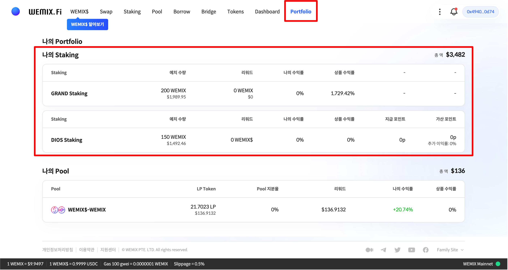
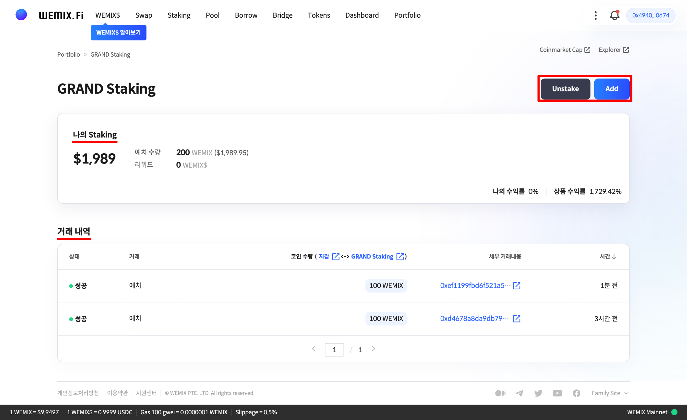
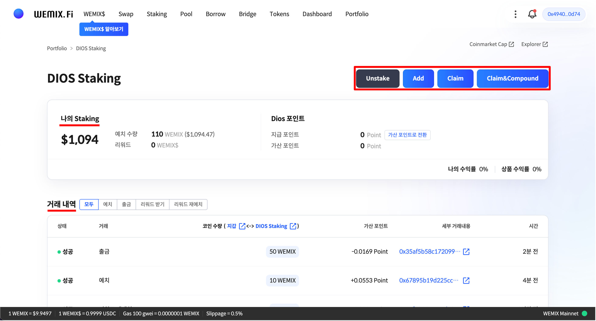

# 스테이킹 관리하기

## 나의 스테이킹 관리하기

<figure><figcaption></figcaption></figure>

* 상단의 'Portfolio' 메뉴를 통해 사용자의 자산을 관리할 수 있습니다. 사용자가 예치중인 스테이킹 프로그램에 대한 정보를 한 눈에 확인할 수 있습니다.

### 그랜드 스테이킹 관리하기

<figure><figcaption></figcaption></figure>

* '그랜드 스테이킹' 프로그램을 클릭하면 세부 예치 정보 및 과거 거래 내역을 확인할 수 있습니다. 또한, 우측 상단에 버튼을 통해 쉽게 자산을 추가로 예치하거나 출금할 수 있습니다.


단, 그랜드 스테이킹 프로그램은 위믹스 거버넌스 Phase2 공개 전까지 출금 기능이 제한됩니다. 사용자가 프로그램에 예치한 자산과 발생한 지급 리워드는 향후에 출금 가능합니다.


### 디오스 스테이킹 관리하기

<figure><figcaption></figcaption></figure>

* '디오스 스테이킹' 프로그램을 클릭하면 세부 예치 정보 및 과거 거래 내역을 확인할 수 있습니다. 또한, 우측 상단에 버튼을 통해 쉽게 자산을 추가로 예치하거나 출금, 리워드 수령 및 재예치 할 수 있습니다.
