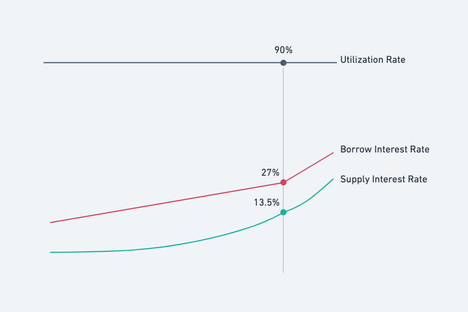

# 이자율 메커니즘

WEMIX.Fi의 Lend\&Borrow 서비스는 자금의 수요와 공급을 조절하고 시장의 이용률이 일정 수준을 초과했을 때 금리가 급격하게 상승하는 ‘점프 이자율 모델’을 적용합니다. 또한, 서비스에 적용되는 이자율은 시장의 이용률을 기반으로 계산되며, 대출 유동성이 풍부할 경우 낮은 이자율이 적용되고 대출 유동성이 부족할 경우 높은 이자율이 적용됩니다.

사용자가 서비스를 통해 얻는 예치 수익률과 지불하는 대출 이자율은 자동으로 복리로 계산됩니다.


WEMIX.Fi의 Lend\&Borrow 서비스는 Compound V2 프로토콜의 Jump-Multiplier 모델을 참고하였습니다.


프로토콜의 이자율 모델에 사용되는 Multiplier, Kink(이용률의 임계값), Jump Multiplier 그리고 최소 이자율(Base Rate)은 모두 상수값이며, Lend\&Borrow 서비스에서 정의한 상수값은 다음과 같습니다.

| 자산      | 상수값(Multiplier) | 이용률의 임계값(Kink) | Jump Multiplier | 최소 이자율(Base Rate) | 예대마진(Reserve Factor) |
| ------- | --------------- | -------------- | --------------- | ----------------- | -------------------- |
| WEMIX   | 5%              | 85%            | 800%            | 0                 | 50%                  |
| WEMIX$  | 5%              | 90%            | 500%            | 0                 | 50%                  |
| stWEMIX | 5%              | 85%            | 800%            | 0                 | 50%                  |

### 이용률

이용률은 프로토콜에 공급된 전체 대출 유동성 대비 전체 대출 금액을 나타내는 수치로, 시장의 활성도를 확인할 수 있는 지표입니다. 프로토콜의 어느 자산에 대한 시장 이용률은 다음 수식에 따라 계산됩니다.

$$
U_a\space=\space Borrows_a \space /\space(Cash_a \space + \space Borrows_a)
$$

* $$U_a: 어느\space 자산의\space 시장\space 이용률$$
* $$Borrows_a:\space 시장을\space 통해\space 대출된\space 자산의\space 양$$
* $$Cash_a:\space 대출\space 자산을\space 제외하고\space 시장에\space 보관된\space 자산의\space 양$$

즉, 자산의 시장 이용률을 통해 시장의 전체 유동성 대비 대출에 사용된 유동량을 확인할 수 있으며, 시장의 활성도를 확인할 수 있습니다. 또한, 시장 이용률이 100%에 도달하면 추가 대출이 불가하며, 100%에 가까워질수록 대출의 수요와 금리가 높을 것을 예측할 수 있습니다.

예를 들어, 철수와 영희가 각각 $500 가치의 WEMIX를 예치하고 짱구가 $100 WEMIX를 대출했다고 가정합니다. 위 수식에 따라 WEMIX의 시장 이용률은 다음과 같습니다:

$$
U_a\space=\space Borrows_a \space /\space(Cash_a \space + \space Borrows_a)
$$

이때, 짱구가 대출 자산을 상환한다면, 예치 규모는 그대로 이지만, 대출의 규모가 감소하면서 이용률은 감소하게됩니다. 이용률이 감소하게 된다면 대출을 장려하기 위해 대출이자율이 낮아지게 될 것입니다. 또한, 예치 이자율은 차용자로 부터 회수하는 이자가 배분되는 것이기 때문에 낮은 대출 이자율은 낮은 대출 이자액으로 연결되어 예치 이자율을 감소시키게 됩니다.

예치 이자율이 낮아진 자산은 예치자들을 유인할 수 있는 매력도가 떨어지기 때문에, 예치자들이 이자율이 더 높은 Market으로 이동하게 만듭니다. 따라서 대출의 감소만큼 예치의 감소되므로 이용률은 기존 값 수준으로 회복되고 이자율은 적정금액으로 돌아오게 됩니다.

프로토콜은 이용률이 100%를 도달하거나 근접하는 것을 방지하기 위해 이용률에 대한 임계값(Kink)을 설정합니다. 이용률이 임계값을 초과할 경우 금리의 증가폭이 급등하면서 예치 규모은 증가, 대출 규모는 감소하고 이용률이 회복됩니다. 자세한 내용은 [**대출 이자율**](https://app.gitbook.com/o/JXrqAdgZEoJOxttZHnJO/s/jUsuIMJLikBncVX0BA9c/\~/changes/xOUOLQ5DKz9fliJXSrKp/Services/borrow/undefined-2#undefined-2)에서 확인할 수 있습니다.

### 예치 이자율

프로토콜의 예치 이자율은 시장의 이용률과 대출 이자율에 따라 결정되며, 다음 수식으로 표현할 수 있습니다.

$$
Supply\space Interest\space Rate_w = Borrowing\space Interest\space Rate_w * U_a * (1-Reserve\space Factor_w)
$$

* $$Borrowing\space Interest\space Rate_w:$$ WEMIX 시장에서 WEMIX를 대출하기 위해 지불해야하는 이자율
* $$Reserve\space Factor_w:$$ 예치와 대출을 통해 프로토콜이 얻는 예대마진(50%)

예를 들어, 철수와 영희가 각각 $100,000 가치의 WEMIX를 예치하고 짱구가 $150,000 WEMIX를 대출했다고 가정합니다. 위 수식에 따라 WEMIX의 시장 이용률은 다음과 같습니다:

$$
\begin{align*}
U_a &=Borrows_a/(Cash_a + Borrows_a)\\
&=150,000/(100,000+100,000)\\
&=75 \%
\end{align*}
$$

시장 이용률에 따라 계산되는 프로토콜의 예치 이자율은 다음과 같습니다:

$$
\begin{align*}
Supply\space Interest\space Rate_w &= Borrowing\space Interest\space Rate_w * U_a * (1-Reserve\space Factor_w) \\
&= Borrowing\space Interest\space Rate * 70 \% * (1-50 \%) \\
&= Borrowing\space Interest\space Rate * 35 \%
\end{align*}
$$

### 대출 이자율

프로토콜의 대출 이자율은 이용률과 ‘최소 이자율(Base Rate)’에 따라 결정되며, 이용률은 ‘임계값(Kink)’을 기준으로 서로 다른 상수를 곱한 값을 더해 계산됩니다.

$$
Borrow\space Interest\space Rate_a = Multiplier\space *\space min(U_a ,Kink)\space + \space Jump \space Rate \space * \space max(0, U_a -Kink)\space+\space Base\space Rate
$$

* $$Multiplier:$$ 대출 이자율을 결정하는 상수값
* $$Jump\space Multiplier:$$ Multiplier와 동일하게 대출 이자율을 결정하는 상수값으로, 이용률이 임계값을 초과하였을 때 적용되어 Multiplier보다 훨씬 높다.
* $$Base\space Rate:$$ 최소 이자율
* $$min(a, b):$$ 임의의 값 a와 b 중에서 더 작은 값
* $$max(a,b):$$ 임의의 값 a와 b 중에서 더 큰 값

위 수식을 그래프로 표현하면 다음과 같습니다.

<figure><figcaption></figcaption></figure>

만약, 이용률이 임계값을 초과할 경우 대출 이자율은 Jump Multiplier에 의해 급격하게 상승하게 되며, 높은 금리를 적용하여 대출에 대한 수요를 낮추고 상환을 장려하여 자산의 활용을 최적화 합니다.

$$
\begin{align*}
& if \hspace {1mm} U_a < Kink: \hspace{5mm} Borrow Interest Rate = Multiplier*U_a + Base Rate\\
& if \hspace {1mm} U_a > Kink:
\hspace{5mm} Borrow Interest Rate = Multiplier*U_a + Jump Rate * (U_a - Kink)+ Base Rate
\end{align*}
$$

예를 들어, 철수와 영희가 각각 $100,000 가치의 WEMIX를 예치하고 짱구가 $190,000 WEMIX를 대출했다고 가정합니다. 위 수식에 따라 시장의 이용률은 95%임을 알 수 있습니다. 시장 이용률에 따라 계산되는 대출 이자율은 다음과 같습니다:

$$
\begin{align*}
Borrow\space Interest\space Rate &= Multiplier*min(U_a ,Kink) + Jump\space Multiplier * max(0, U_a - Kink) + Base\space Rate \\
&= 30\% * 90\% + 109\% *(95\% -90\% ) \\
&= 0.27+0.05 \\
&= 32\%
\end{align*}
$$
