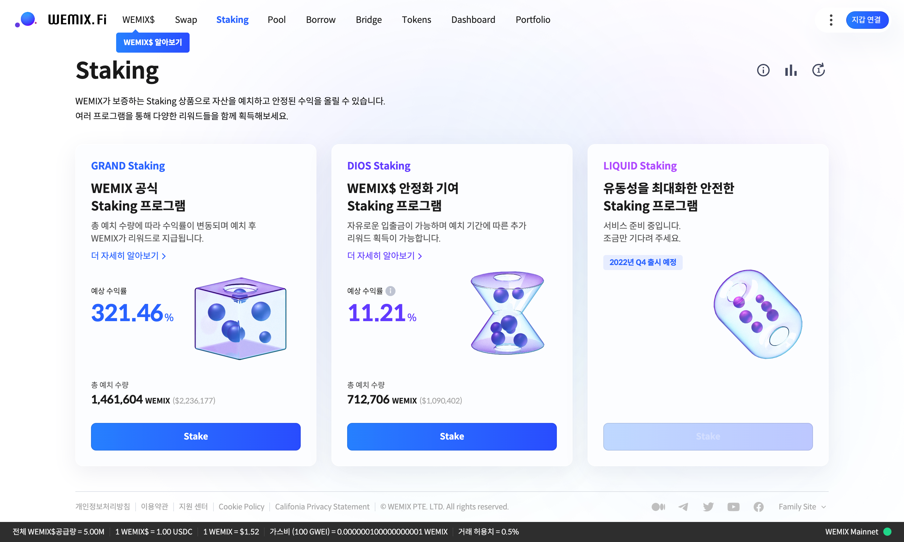

# 스테이킹

<figure><figcaption></figcaption></figure>

WEMIX.Fi에서 운영되는 다양한 스테이킹 프로그램에 자산을 예치하고 안정된 수익을 얻을 수 있습니다. 스테이킹을 통해 다양한 리워드를 획득 해보세요.

* **그랜드 스테이킹**은 블록체인 네트워크에서 발생하는 블록 보상의 일부를 수익으로 받는 상품으로 예치 시 WEMIX가 리워드로 지급됩니다.
* **디오스 스테이킹**은 WEMIX$ 안정화 프로토콜(DIOS)에서 발생하는 수익의 일부를 받는 상품으로 예치 시 WEMIX$가 리워드로 지급됩니다.
* **리퀴드 스테이킹**은 현재 준비 중인 상품으로 2022년 4분기에 공개될 예정입니다.

## **스테이킹이란?**

WEMIX.Fi의 스테이킹은 사용자가 보유한 자산을 예치하여 블록체인 네트워크 안정화에 직/간접적으로 참여할 수 있는 시스템입니다. 사용자는 위믹스 공식 스테이킹 프로그램인 ‘그랜드 스테이킹’과 WEMIX$의 가격 안정화에 기여하는 스테이킹 프로그램인 ‘디오스 스테이킹’에 참여할 수 있습니다. 사용자는 각 프로그램의 특징과 수익률을 확인하고 원하는 프로그램에 자산을 예치할 수 있습니다.

**그랜드 스테이킹** 프로그램은 사용자가 자산을 예치하는 대가로 블록체인 네트워크에서 발생하는 '블록 보상'의 일부를 수익으로 받는 상품입니다. 단, 예치한 자산과 발생한 수익은 일정 기간 동안 출금이 제한되며, 2023년 7월 이후 업데이트 예정입니다.

**디오스 스테이킹** 프로그램은 사용자가 위믹스달러 스테이블코인의 가치가 $1로 유지되도록 기여하는 대가로 WEMIX$ 안정화 프로토콜에서 발생한 수익의 일부를 받는 상품입니다. 자산을 예치한 기간에 따라 발생한 지급 포인트를 활용할 경우 수익을 최대 100%까지 증가시킬 수 있습니다.

| 그랜드 스테이킹            | 디오스 스테이킹         |
| ------------------- | ---------------- |
| 최소 1 WEMIX 이상 예치    | 최소 1 WEMIX 이상 예치 |
| 리워드는 WEMIX로 지급      | 리워드는 WEMIX$로 지급  |
| 출금은 **Phase2**부터 가능 | 출금 **제한 없음**     |
| 지급 포인트 **미지급**      | 지급 포인트 **지급**    |

각 프로그램에 대한 자세한 내용은 [그랜드 스테이킹](grand-staking.md)과 [디오스 스테이킹](dios-staking.md)에서 확인할 수 있습니다.

### 예상 지급 리워드

예상 지급 리워드는 스테이킹 프로그램에 참여한 사용자가 자산을 예치한 대가로 얻는 수익을 의미합니다. 사용자가 예치한 자산의 규모에 따라 계산되며 자산을 추가로 예치하거나 출금할 때 예상 지급 리워드가 변하는 것을 확인할 수 있습니다. 그랜드 스테이킹 프로그램의 리워드는 WEMIX로 지급되며 Phase2 이후 부터 출금이 가능합니다. 디오스 스테이킹 프로그램의 리워드는 WEMIX$로 지급되며 사용자의 선택에 따라 출금과 재예치가 가능합니다. 지급 리워드에 대한 자세한 내용은 [그랜드 스테이킹](grand-staking.md)과 [디오스 스테이킹](dios-staking.md)에서 확인할 수 있습니다.

### 지급 포인트

지급 포인트는 디오스 스테이킹 프로그램에 참여한 사용자가 수익을 극대화할 수 있는 장치입니다. 지급 포인트는 가산 포인트로 전환이 가능하며, 전환된 가산 포인트는 1 포인트당 1 WEMIX의 가치를 갖습니다.

### 실시간 수익률 차트

실시간 수익률 차트는 두 가지 스테이킹 프로그램의 1일, 1주, 1달 등 선택한 기간에 따른 그래프 정보를 조회할 수 있습니다. 또한, 그래프 좌측 상단에 표기된 날짜를 기준으로 전일 대비 수익률의 증감률을 확인할 수 있습니다.

## 스테이킹 사용 예시

### 그랜드 스테이킹 프로그램에 예치하는 경우

철수는 위믹스 메인넷에서 WEMIX를 보유하고 있습니다. 철수는 당분간 WEMIX를 활용할 계획이 없으며, 자산을 안전하게 예치하여 수익을 얻을 방법을 찾고 있습니다. 철수는 그랜드 스테이킹 프로그램에 참여하면 보유한 WEMIX를 예치하고 수익을 얻을 수 있습니다.&#x20;

### 디오스 스테이킹 프로그램에 예치하는 경우

영희는 스테이블코인에 관심이 많습니다. 위믹스 메인넷의 스테이블코인인 WEMIX$가 가격을 안정적으로 유지할 수 있도록 기여하고 싶었던 영희는 디오스 스테이킹에 참여하기로 합니다. 출금이 일시적으로 제한되는 그랜드 스테이킹과 달리 자유롭게 출금할 수 있어서 편리했고 프로그램에서 발생한 지급 포인트를 가산 포인트로 전환하여 재예치하자 수익률이 상승한 것을 확인할 수 있었습니다.
